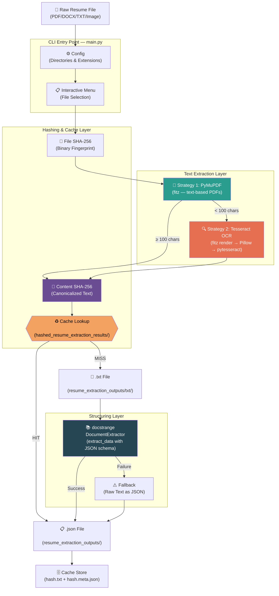
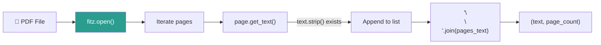
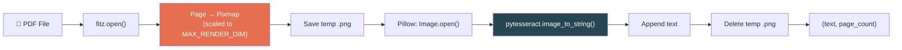
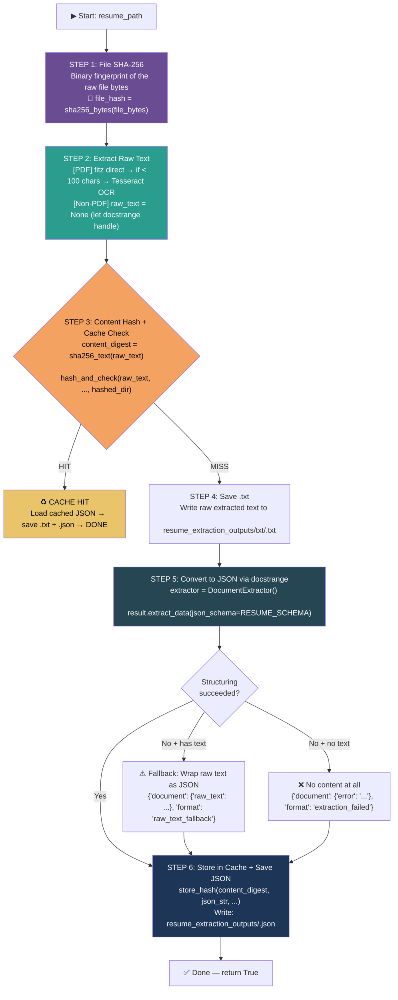
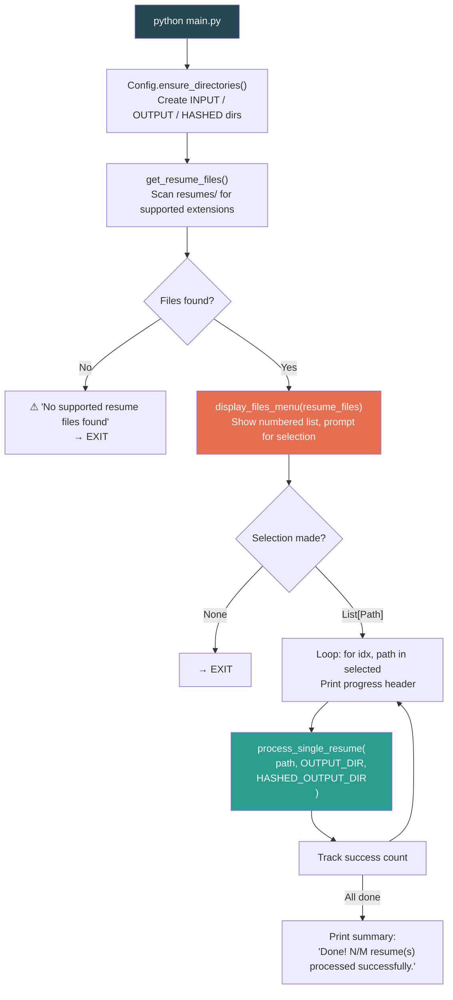
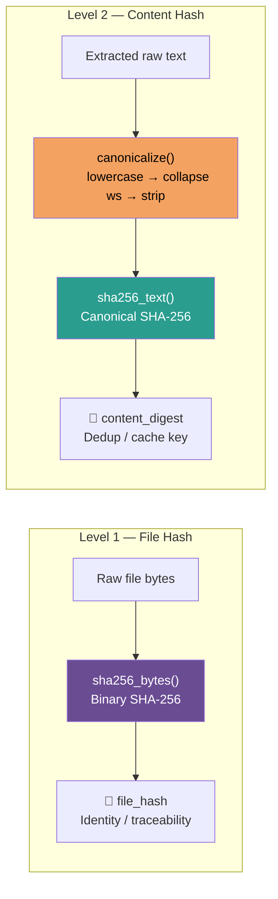
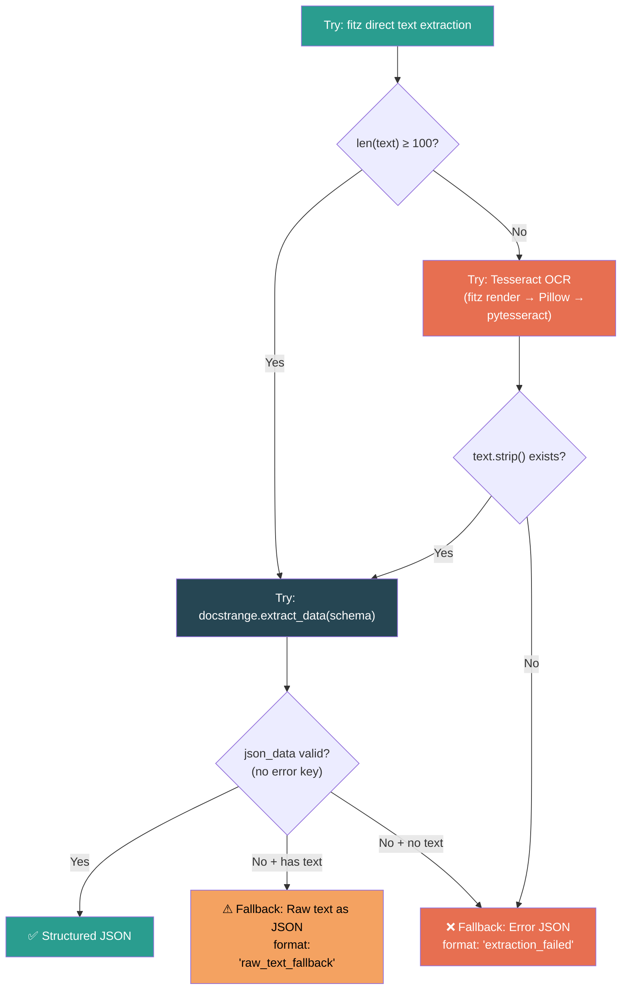
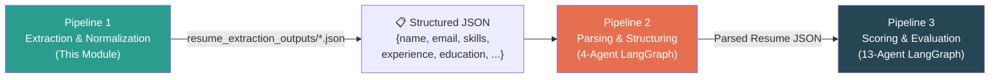

# Resume Extraction & Parsing — Final Workflow

## Module Overview

**Directory:** `modularized_resume_extraction_normalization/`

This module is **Pipeline 1** of the RAIYA Recruiting Solution — the foundational data preparation layer. It takes raw resume files (PDF, DOCX, TXT, images) and converts them into clean, structured JSON with consistent field normalization. The module employs a **multi-strategy extraction approach** (text-first, OCR-fallback) with a **SHA-256 content-hashing cache** to avoid redundant processing.

> [!IMPORTANT]
> **Design Principles:**
> - **Text-first extraction** — Always attempt native text extraction (PyMuPDF/fitz) before falling back to OCR.
> - **Deterministic pipeline** — Zero LLM calls. All extraction and structuring is rule-based.
> - **Content-aware caching** — SHA-256 of raw extracted text enables deduplication across renamed/resubmitted files.
> - **Graceful degradation** — If all extraction fails, still produce valid JSON output with error metadata.

---

## Architecture



---

## Module Structure

```
modularized_resume_extraction_normalization/
├── main.py                                    # CLI entry point & processing pipeline
├── resume_extraction_parsing_final_workflow.md # ← This document
│
├── modules/
│   ├── __init__.py         # Package init — sys.path setup for docstrange + re-exports
│   ├── config.py           # Config class — directories, supported extensions, knobs
│   ├── file_utils.py       # File discovery, size formatting, filename sanitization
│   ├── menu.py             # Interactive CLI menu — selection parsing (all/range/comma/single)
│   ├── hashing.py          # SHA-256 hashing + cache system (canonicalize, hash, store, lookup)
│   └── docstrange-main/    # Embedded document extraction library
│       └── docstrange/
│           ├── extractor.py            # DocumentExtractor class
│           ├── pipeline/               # OCR, layout detection, neural processing
│           └── processors/             # Format-specific processors (PDF, DOCX, Image, etc.)
│
├── resume_extraction_outputs/              # Final output directory
│   ├── txt/                                # Extracted raw text files
│   └── *.json                              # Structured JSON per resume
│
├── hashed_resume_extraction_results/       # Content hash cache
│   ├── <sha256>.txt                        # Cached JSON output (keyed by content hash)
│   └── <sha256>.meta.json                  # Cache metadata (source, timestamp, lengths)
│
└── resume_extraction_outputs_parsed_json/  # Additional parsed output directory
    └── txt/
```

---

## Core Modules — Detailed Breakdown

### 1. `main.py` — CLI Entry Point & Pipeline Orchestrator

| Property | Value |
|----------|-------|
| **Lines** | 335 |
| **Role** | Central orchestrator — ties all modules together |
| **LLM** | ❌ None |

**Responsibilities:**
- Defines the `RESUME_SCHEMA` (JSON schema for structured extraction)
- Implements `extract_text_with_fitz()` (native text extraction)
- Implements `extract_text_with_ocr()` (Tesseract OCR fallback)
- Implements `process_single_resume()` (full 6-step pipeline per file)
- Implements `main()` (CLI loop — directory check → menu → batch processing)

---

### 2. `modules/config.py` — Configuration

| Property | Value |
|----------|-------|
| **Class** | `Config` |
| **Pattern** | Class-level constants with a `@classmethod` factory |

```python
class Config:
    INPUT_DIR     = <project_root>/../resumes/           # Raw resume input
    OUTPUT_DIR    = <project_root>/resume_extraction_outputs/    # Extraction output
    HASHED_OUTPUT_DIR = <project_root>/hashed_resume_extraction_results/  # Cache

    SUPPORTED_EXTENSIONS = {
        ".pdf", ".docx", ".doc", ".txt", ".rtf",
        ".html", ".htm", ".xlsx", ".xls", ".csv",
        ".pptx", ".ppt",
        ".jpg", ".jpeg", ".png", ".bmp", ".tiff", ".webp", ".gif",
    }

    PROCESSING = {"max_workers": 4}
```

| Method | Purpose |
|--------|---------|
| `ensure_directories()` | Creates `INPUT_DIR`, `OUTPUT_DIR`, `HASHED_OUTPUT_DIR` if missing |

---

### 3. `modules/file_utils.py` — File Discovery & Utilities

| Function | Args | Returns | Purpose |
|----------|------|---------|---------|
| `get_resume_files()` | `input_dir?`, `exclude_subdirs?` | `List[Path]` | Scans input directory for supported file extensions; sorted alphabetically |
| `get_files_by_type()` | `input_dir?` | `Dict[str, List[Path]]` | Groups discovered files by extension |
| `get_file_info()` | `file_path` | `Dict[str, Any]` | Returns metadata (name, stem, extension, size, path) |
| `format_file_size()` | `size_bytes` | `str` | Human-readable size formatting (e.g. `"1.23 MB"`) |
| `sanitize_filename()` | `filename` | `str` | Removes unsafe chars, collapses underscores, strips edge characters |
| `list_directory_contents()` | `directory` | `List[Dict]` | Lists all files in a directory with metadata |

---

### 4. `modules/menu.py` — Interactive CLI Menu

| Function | Purpose |
|----------|---------|
| `display_files_menu(resume_files)` | Displays numbered file list, prompts for selection, returns `List[Path]` or `None` |
| `parse_selection(selection, max_index)` | Parses user input into 0-based indices |

**Supported Selection Formats:**

| Input | Behavior |
|-------|----------|
| `all` | Process all files |
| `1,3,5` | Comma-separated file numbers |
| `2-7` | Range (inclusive) |
| `q` / `quit` / `exit` | Cancel session |
| `3` | Single file number |

---

### 5. `modules/hashing.py` — SHA-256 Hashing & Cache System

> [!NOTE]
> **Hashing Rule:** Only raw extracted plain text (UTF-8) is ever hashed — never markdown, JSON, PDF binary, filenames, or metadata. This ensures consistent deduplication even when the same resume is submitted in different file formats or with different names.

| Function | Input | Output | Purpose |
|----------|-------|--------|---------|
| `canonicalize(text)` | Raw text | Canonical text | Lowercase → collapse whitespace → strip (normalization before hashing) |
| `sha256_text(text)` | Raw text | 64-char hex | Primary hash function — canonicalizes, then SHA-256 (UTF-8 encoded) |
| `sha256_bytes(data)` | Raw bytes | 64-char hex | File-level binary fingerprint (no canonicalization) |
| `section_hashes(sections)` | `Dict[str, str]` | `Dict[str, str]` | Per-section SHA-256 digests for tailoring detection |
| `hash_and_check(text, source_file, cache_dir)` | Raw text, filename, cache path | `(digest, hit?, cached_json?)` | Full cache lifecycle: hash → lookup → return result |
| `lookup_hash(digest, cache_dir)` | Hex digest, path | `Optional[str]` | Reads `<hash>.txt` from cache if it exists |
| `store_hash(digest, output, source_file, cache_dir, extracted_text)` | All metadata | `None` | Writes `<hash>.txt` (JSON output) + `<hash>.meta.json` (metadata) |

**Cache File Structure:**

```
hashed_resume_extraction_results/
├── a1b2c3d4e5f6...abc.txt          # The full JSON output (cached)
├── a1b2c3d4e5f6...abc.meta.json    # Metadata:
│   {
│     "sha256": "a1b2c3d4...",
│     "source_file": "John_Doe_Resume.pdf",
│     "source_type": "extracted_text",
│     "encoding": "utf-8",
│     "stored_at": "2026-03-10T18:30:00+00:00",
│     "content_length": 4523,
│     "extracted_text_length": 1280
│   }
```

---

### 6. `modules/__init__.py` — Package Initialization

**Critical function:** Adds `docstrange-main/` to `sys.path` so the embedded `docstrange` library can be imported directly.

**Re-exports (public API):**

```python
from modules import (
    Config,
    get_resume_files, format_file_size, sanitize_filename,
    display_files_menu, parse_selection,
    hash_and_check, store_hash, sha256_text, sha256_bytes, section_hashes,
    DocumentExtractor, ConversionResult,
)
```

---

## Extraction Strategies

### Strategy 1 — PyMuPDF (fitz) Direct Text Extraction



- **When used:** First attempt for all PDFs
- **Success threshold:** Text length ≥ 100 characters
- **If fails:** Falls through to Strategy 2

---

### Strategy 2 — Tesseract OCR (via fitz rendering)



- **When used:** When fitz direct extraction yields < 100 chars (image-based/scanned PDFs)
- **Scaling logic:** `scale = min(MAX_RENDER_DIM / max(w,1), MAX_RENDER_DIM / max(h,1), 300/72)`
  - `MAX_RENDER_DIM = 2500` (longest-edge cap to handle oversized MediaBox pages)
  - Effective DPI capped at 300 for standard-size pages
- **Cleanup:** Temp `.png` files are deleted in `finally` blocks

---

### Strategy 3 — docstrange Direct (Non-PDF Files)

- **When used:** For non-PDF files (DOCX, TXT, images, etc.)
- **Behavior:** `raw_text` is set to `None`, docstrange handles the original file directly
- **No OCR fallback needed:** docstrange has built-in format-specific processors

---

## JSON Schema — Structured Output Format

The `RESUME_SCHEMA` defines the target structure that `docstrange.extract_data()` maps extracted content into:

```json
{
    "name": "string (Required)",
    "email": "string (Optional)",
    "skills": ["string"],
    "experience": [
        {
            "title": "string",
            "company": "string",
            "start": "string (ISO8601 or 'Month Year')",
            "end": "string",
            "description": "string (Optional)",
            "responsibilities": ["string"]
        }
    ],
    "projects": [
        {
            "name": "string",
            "description": "string",
            "technologies": ["string"]
        }
    ],
    "education": [
        {
            "degree": "string",
            "institution": "string",
            "year": "string or int"
        }
    ],
    "certifications": ["string"],
    "tools": ["string"],
    "technologies": ["string"],
    "salary_expectation": {
        "value": "string or number",
        "currency": "string"
    }
}
```

---

## Per-Resume Processing Pipeline — 6-Step Flow

The `process_single_resume()` function executes the following pipeline for each file:



### Step-by-Step Details

| Step | Operation | Key Function(s) | Output |
|------|-----------|-----------------|--------|
| **1** | File SHA-256 | `sha256_bytes(file_bytes)` | `file_hash` — binary fingerprint for traceability |
| **2** | Raw text extraction | `extract_text_with_fitz()` → `extract_text_with_ocr()` | `raw_text`, `page_count` |
| **3** | Content hash + cache | `hash_and_check(raw_text, file_name, hashed_dir)` | `(content_digest, cache_hit, cached_json_str)` |
| **4** | Save .txt | `open(txt_path, "w")` | `resume_extraction_outputs/txt/<stem>.txt` |
| **5** | JSON structuring | `DocumentExtractor().extract()` → `result.extract_data(json_schema=RESUME_SCHEMA)` | `json_data` dict |
| **6** | Cache store + save JSON | `store_hash()` → `json.dump()` | `<hash>.txt`, `<hash>.meta.json`, `<stem>.json` |

---

## Main CLI Flow



---

## Console Output Example

```
📄 Found 5 resume(s):

  [  1]  John_Doe_Resume.pdf  (476.5 KB)
  [  2]  Jane_Smith_Resume.pdf  (395.2 KB)
  [  3]  Bob_Wilson_Resume.docx  (22.3 KB)
  [  4]  Alice_Jones_Resume.pdf  (477.7 KB)
  [  5]  CV_Generic.pdf  (82.8 KB)

Options:  'all' → process all  |  '1,3,5' → select specific  |  '1-5' → range  |  'q' → quit

▶ Enter selection: all

============================================================
  Processing 5 resume(s)…
============================================================

── [1/5] John_Doe_Resume.pdf ──
   🔑 File hash: a1b2c3d4e5f6a7b8…
   ✅ Text-based PDF — extracted 1280 chars (2 pages)
   🔐 Content hash: 9f8e7d6c5b4a3210…
   🆕 Cached new result (hash: 9f8e7d6c5b4a3210…)
   📝 Saved TXT → resume_extraction_outputs\txt\John_Doe_Resume.txt
   ✅ Structured JSON extraction succeeded.
   ✅ Saved JSON → resume_extraction_outputs\John_Doe_Resume.json

── [2/5] Jane_Smith_Resume.pdf ──
   🔑 File hash: b2c3d4e5f6a7b8c9…
   ⚠  PDF appears image-based — switching to Tesseract OCR…
   📄 Page 1: 856 chars extracted via Tesseract OCR
   📄 Page 2: 742 chars extracted via Tesseract OCR
   ✅ Tesseract OCR extracted 1598 chars (2 pages)
   🔐 Content hash: 1a2b3c4d5e6f7890…
   🆕 Cached new result (hash: 1a2b3c4d5e6f7890…)
   📝 Saved TXT → resume_extraction_outputs\txt\Jane_Smith_Resume.txt
   ✅ Structured JSON extraction succeeded.
   ✅ Saved JSON → resume_extraction_outputs\Jane_Smith_Resume.json

── [3/5] John_Doe_Resume_v2.pdf ──
   🔑 File hash: c3d4e5f6a7b8c9d0…
   ✅ Text-based PDF — extracted 1280 chars (2 pages)
   🔐 Content hash: 9f8e7d6c5b4a3210…
   ♻  Cache HIT — skipping docstrange extraction.
   📝 Saved TXT → resume_extraction_outputs\txt\John_Doe_Resume_v2.txt
   ✅ Saved JSON → resume_extraction_outputs\John_Doe_Resume_v2.json  (from cache)

============================================================
  Done! 3/3 resume(s) processed successfully.
============================================================
```

---

## Supported File Formats

| Category | Extensions | Extraction Method |
|----------|-----------|-------------------|
| **PDF (text-based)** | `.pdf` | PyMuPDF (`fitz`) direct text extraction |
| **PDF (scanned/image)** | `.pdf` | PyMuPDF render → Tesseract OCR |
| **Word Documents** | `.docx`, `.doc` | docstrange (python-docx) |
| **Plain Text** | `.txt`, `.rtf` | docstrange (direct read) |
| **Web Documents** | `.html`, `.htm` | docstrange (HTML parser) |
| **Spreadsheets** | `.xlsx`, `.xls`, `.csv` | docstrange (Excel/CSV processor) |
| **Presentations** | `.pptx`, `.ppt` | docstrange (PPTX processor) |
| **Images** | `.jpg`, `.jpeg`, `.png`, `.bmp`, `.tiff`, `.webp`, `.gif` | docstrange (OCR pipeline) |

---

## Hashing & Caching — Deep Dive

### Two-Level Hash Architecture



| Level | Hash Function | What's Hashed | Purpose |
|-------|---------------|---------------|---------|
| **Level 1** | `sha256_bytes(file_bytes)` | Raw file binary | File identity — different for renamed copies of same content |
| **Level 2** | `sha256_text(raw_text)` | Canonicalized extracted text | Content deduplication — identical for renamed/reformatted copies |

### Canonicalization Rules

```
Input:  "  John   DOE\n\nSoftware   Engineer  "
Step 1: lowercase  →  "  john   doe\n\nsoftware   engineer  "
Step 2: collapse   →  " john doe software engineer "
Step 3: strip      →  "john doe software engineer"
```

This ensures that spacing/casing differences across different PDF renderers or OCR engines don't produce different hashes.

### Cache Lifecycle

```
1. Extract raw text from resume
2. Canonicalize text → compute SHA-256 → content_digest
3. LOOKUP: Does hashed_resume_extraction_results/<content_digest>.txt exist?
   ├── YES → Cache HIT: load cached JSON, skip docstrange, save output
   └── NO  → Cache MISS: proceed with full pipeline
4. After successful processing:
   STORE: Write <content_digest>.txt (JSON) + <content_digest>.meta.json (metadata)
```

---

## Error Handling & Fallback Chain



| Scenario | Result |
|----------|--------|
| fitz extracts ≥ 100 chars + docstrange succeeds | ✅ Full structured JSON |
| fitz < 100 chars → OCR extracts text + docstrange succeeds | ✅ Full structured JSON |
| Extraction succeeds but docstrange fails | ⚠️ Raw text wrapped as JSON (`raw_text_fallback`) |
| All extraction methods fail | ❌ Error JSON (`extraction_failed`) |
| Cache hit on content hash | ♻️ Cached JSON loaded directly (no docstrange call) |

> [!TIP]
> Even complete extraction failures produce valid JSON output. Downstream pipelines (Pipeline 2 — Parsing) can check the `format` field to decide how to handle the result.

---

## Dependencies

| Package | Version | Purpose |
|---------|---------|---------|
| `PyMuPDF` (fitz) | ≥ 1.23 | PDF text extraction + page-to-image rendering |
| `pytesseract` | ≥ 0.3 | Tesseract OCR Python wrapper |
| `Pillow` (PIL) | ≥ 10.0 | Image handling for Tesseract input |
| `docstrange` | embedded | Multi-format document extraction + structured data extraction |

**System requirement:** Tesseract OCR must be installed and on `PATH` (or set `pytesseract.pytesseract.tesseract_cmd`).

---

## Output Locations

| Output | Path | Format |
|--------|------|--------|
| Extracted raw text | `resume_extraction_outputs/txt/<stem>.txt` | Plain text (UTF-8) |
| Structured JSON | `resume_extraction_outputs/<stem>.json` | JSON (indent=4, UTF-8) |
| Hash cache — output | `hashed_resume_extraction_results/<sha256>.txt` | Cached JSON string |
| Hash cache — metadata | `hashed_resume_extraction_results/<sha256>.meta.json` | Cache metadata JSON |

---

## Running the Pipeline

### Prerequisites

```bash
# Install Python dependencies
pip install pymupdf pytesseract Pillow

# Install Tesseract OCR (system-level)
# Windows: Download from https://github.com/UB-Mannheim/tesseract/wiki
# macOS:   brew install tesseract
# Linux:   sudo apt install tesseract-ocr
```

### Execution

```bash
# Navigate to the project root
cd RAIYA_RECRUITING_SOLUTION

# Run the extraction pipeline
python -m modularized_resume_extraction_normalization.main

# Or run directly
python modularized_resume_extraction_normalization/main.py
```

### Input

Place resume files in `resumes/` directory (relative to the RAIYA project root). The system auto-discovers all supported file types.

### Output

After processing, find results in:
- **Text:** `modularized_resume_extraction_normalization/resume_extraction_outputs/txt/`
- **JSON:** `modularized_resume_extraction_normalization/resume_extraction_outputs/`
- **Cache:** `modularized_resume_extraction_normalization/hashed_resume_extraction_results/`

---

## Integration with Downstream Pipelines

This module's JSON output feeds directly into **Pipeline 2 — Resume Parsing & Structuring**:



> [!IMPORTANT]
> **Contract with Pipeline 2:** The JSON output from this module must conform to the `RESUME_SCHEMA` structure. Pipeline 2's Extractor Agent (Agent 1) consumes these files and maps them into the full parsed resume schema with additional LLM reasoning.

---

## Cross-Reference

| Document | Path | Contents |
|----------|------|----------|
| **This document** | `modularized_resume_extraction_normalization/resume_extraction_parsing_final_workflow.md` | Full extraction pipeline workflow |
| **Project-level workflow** | `RAIYA-PROJECT-FINAL-WORKFLOW.md` | End-to-end project workflow (all 3 pipelines) |
| **Scoring agent workflow** | `modularized_resume_scoring_agent/.../resume_scoring_agent_final_workflow.md` | Full 13-agent scoring spec |
