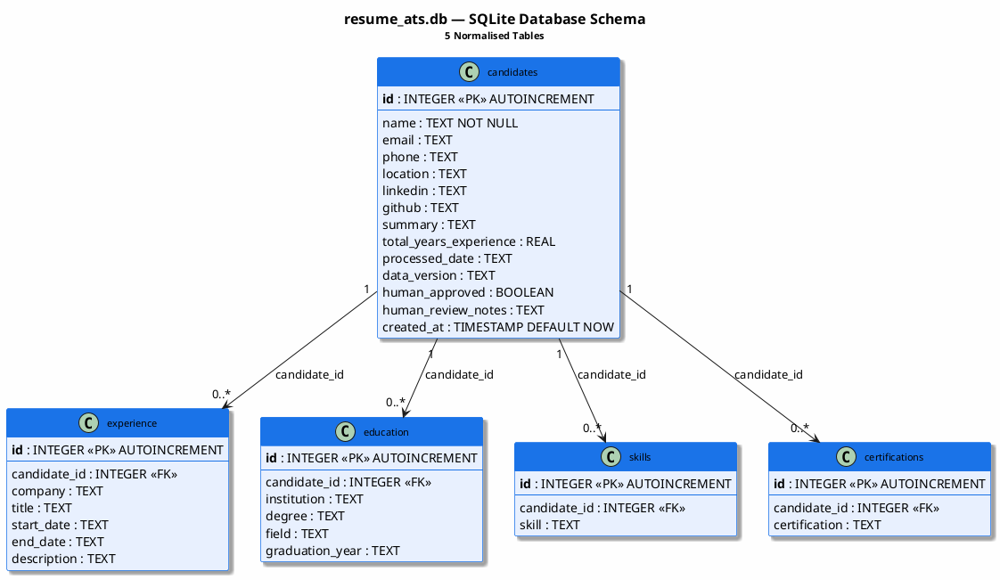
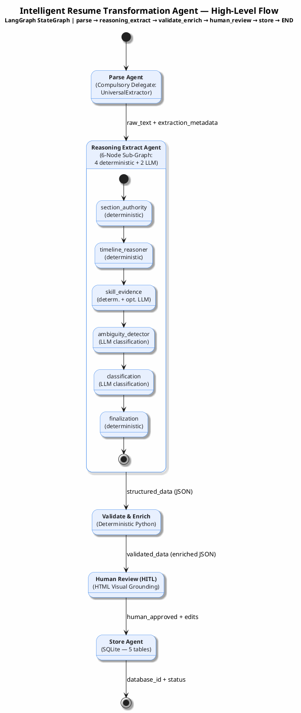

# Intelligent Resume Transformation Agent — PlantUML Workflow Diagram

## Powered by LangGraph & Azure OpenAI Phi-4 LLM

---

## Complete End-to-End Pipeline Workflow

```plantuml
@startuml Intelligent_Resume_Transformation_Agent_Pipeline

' ──────────────────────────────────────────────────────────────────
'  THEME & STYLING
' ──────────────────────────────────────────────────────────────────
skinparam backgroundColor #FEFEFE
skinparam shadowing true
skinparam defaultFontName "Segoe UI"
skinparam defaultFontSize 12

skinparam activity {
    BackgroundColor #E8F0FE
    BorderColor #1A73E8
    FontColor #202124
    DiamondBackgroundColor #FFF3E0
    DiamondBorderColor #E65100
    DiamondFontColor #BF360C
}

skinparam partition {
    BackgroundColor #F8F9FA
    BorderColor #DADCE0
    FontColor #202124
    FontSize 14
    FontStyle bold
}

skinparam note {
    BackgroundColor #FFFDE7
    BorderColor #F9A825
    FontColor #333333
    FontSize 10
}

title <size:20><b>Intelligent Resume Transformation Agent — Complete Workflow</b></size>\n<size:14>LangGraph + Multi-Node Reasoning Graph + Azure OpenAI Phi-4</size>

' ──────────────────────────────────────────────────────────────────
'  START
' ──────────────────────────────────────────────────────────────────
|#E3F2FD|Main Pipeline (LangGraph StateGraph)|

start

:📄 **Resume File Input**
  (PDF / DOCX / TXT / RTF);

note right
  **ResumeState initialized:**
  • file_path: str
  • file_type: str
  • status: "processing"
  • messages: []
end note

' ──────────────────────────────────────────────────────────────────
'  PHASE 0: INITIALIZATION
' ──────────────────────────────────────────────────────────────────
partition "**Phase 0: Initialization**" {
    :⚙️ **Load Environment Variables** (.env)
    ── AZURE_OPENAI_API_KEY
    ── AZURE_OPENAI_ENDPOINT
    ── AZURE_OPENAI_API_VERSION
    ── AZURE_OPENAI_DEPLOYMENT_NAME = "phi-4";

    :🔌 **Initialize AzureOpenAI Client**
    (temperature=0, strict JSON mode);

    :🔗 **Create LangGraph StateGraph**
    Compile workflow with 5 nodes:
    parse → reasoning_extract → validate_enrich
    → human_review → store → END;
}

' ──────────────────────────────────────────────────────────────────
'  PHASE 1: STATE SCHEMA
' ──────────────────────────────────────────────────────────────────
partition "**Phase 1: State Schema Definition**" {
    :📋 **Define ResumeState (TypedDict)**
    ── file_path, file_type
    ── raw_text, parse_error
    ── extraction_metadata
    ── structured_data, extract_error
    ── validated_data, validation_error
    ── human_approved, human_review_notes
    ── database_id, store_error
    ── status, messages[];
}

' ──────────────────────────────────────────────────────────────────
'  PHASE 2: PARSE AGENT
' ──────────────────────────────────────────────────────────────────

|#E8F5E9|Parse Agent (Agent 1)|

partition "**Phase 2: Parse Agent — Compulsory Delegate to UniversalExtractor**" {

    :🔍 **parse_agent(state)**
    LangGraph Node
    Reads: state['file_path'];

    note right
      **COMPULSORY DELEGATION CONTRACT**
      • NO standalone parse_pdf(), parse_docx(), parse_txt()
      • ALL extraction via UniversalExtractor only
      • Single entry point: extract_universal(file_path)
    end note

    :📂 **Add extraction pipeline to sys.path**
    modularized_resume_extraction_normalization/;

    :🏗️ **Initialize UniversalExtractor**
    _universal_extractor = UniversalExtractor(
        use_gpu=False, use_neural_ocr=False
    );

    ' ── UniversalExtractor Internal Flow ──

    |#C8E6C9|UniversalExtractor (Compulsory Delegate)|

    :🔐 **Step 0: File Identity Hash**
    SHA-256 of raw file bytes;

    :🔎 **Step 1: Layout Detection**
    LayoutDetector.detect_multi_layout(file_path)
    ── Page count analysis
    ── Column/sidebar pattern detection
    ── Image-based vs text-based classification;

    if (Multi-page AND\nmulti-layout?\n(sidebar / multi-column)) then (yes)
        :📐 **_extract_multi_layout_custom()**
        ── ColumnExtractor per page
        ── _classify_content_sides() (main vs sidebar)
        ── _extract_candidate_name();

        note right
          Components:
          • **ColumnExtractor** (column_extractor.py)
          • **HeadingFormatter** (heading_formatter.py)
          • L/R column separation per page
        end note
    else (no)
        :📄 **StandardExtractor.extract()**
        ── docstrange DocumentExtractor
        (single-page any layout OR
        multi-page single-column);

        note left
          Components:
          • **StandardExtractor** (standard_extraction.py)
          • docstrange pipeline
        end note
    endif

    :🔏 **Step 3: Fingerprinting**
    ── content_hash = SHA-256(get_raw_extracted_text())
    ── section_hashes = per-section SHA-256 digests;

    :📦 **ExtractionResult**
    ── .content / .main_content / .sidebar_content
    ── .layout_type, .pages, .is_image_based
    ── .file_hash, .content_hash, .section_hashes
    ── .get_raw_extracted_text() → plain text
    ── .to_enhanced_markdown() → formatted md;

    |#E8F5E9|Parse Agent (Agent 1)|

    if (raw_text is empty\nor None?) then (yes)
        :❌ **ValueError**
        "UniversalExtractor returned empty text";
        :state['parse_error'] = error message
        state['raw_text'] = None;
    else (no)
        :✅ **Populate State**
        state['raw_text'] = result.get_raw_extracted_text()
        state['parse_error'] = None
        state['extraction_metadata'] = {
            layout_type, pages, is_image_based,
            extraction_method, word_count,
            file_hash, content_hash,
            section_hashes, enhanced_markdown
        };
    endif
}

' ──────────────────────────────────────────────────────────────────
'  PHASE 3: REASONING EXTRACT AGENT
' ──────────────────────────────────────────────────────────────────

|#FFF3E0|Reasoning Extract Agent (Agent 2)|

partition "**Phase 3: Reasoning Extract Agent — Multi-Node Reasoning Graph**" {

    :🧠 **reasoning_extract_agent(state)**
    LangGraph Node
    Source: pipeline_bridge.py;

    note right
      **Drop-in replacement** for old
      monolithic Extract Agent.
      LLM used **only** for classification
      (not full extraction).
    end note

    if (parse_error exists?) then (yes)
        :❌ Set extract_error
        "Cannot extract: parse failed"
        Return state;
        detach
    else (no)
    endif

    ' ── Step 1: Adapter In ──

    |#FFE0B2|Extraction Adapter (In)|

    :🔄 **extraction_adapter.py**
    extraction_result_to_reasoning_state(raw_text, content_hash)
    ── split_sections() — regex-based section splitting
    ── extract_roles_deterministic() — pattern-matched
    ── extract_skills_deterministic() — delimiter-based
    ── Contact parsing — regex (email, phone, LinkedIn, GitHub);

    note right
      Produces **ReasoningState** TypedDict:
      • content_hash, raw_text
      • sections, roles, skills
      • normalized_skills, timeline_analysis
      • ambiguities, confidence_flags
      • audit_log
    end note

    ' ── Step 2: 6-Node Sub-Graph ──

    |#FFCC80|6-Node Reasoning Sub-Graph|

    :🏃 **graph_runner.py**
    run_reasoning_graph(reasoning_state);

    ' ── Node 1 ──
    :🔒 **Node 1: section_authority_node** ❌ No LLM
    (deterministic)
    ── Reads: state['sections'], state['roles']
    ── Validates: experience claims from correct sections
    ── Writes: state['roles'] + authority_flag
    ── Source: nodes/section_authority_node.py;

    note right #E8F5E9
      **Deterministic**
      No LLM call
    end note

    ' ── Conditional check ──
    if (Experience data\nexists in roles?) then (yes)

        ' ── Node 2 ──
        :⏱️ **Node 2: timeline_reasoner_node** ❌ No LLM
        (deterministic — pure date math)
        ── Reads: state['roles'] with dates
        ── Computes: date overlaps, total experience
        ── Detects: parallel employment inflation
        ── Writes: state['timeline_analysis'] = {
            total_months, overlapping_roles,
            gaps, parallel_employment_flags
        }
        ── Source: nodes/timeline_reasoner_node.py;

        note right #E8F5E9
          **Deterministic**
          No LLM call
        end note

    else (no — skip)
        :⚡ Skip timeline_reasoner
        (no experience data);

        note right
          **transitions.py** handles
          conditional node skipping
        end note
    endif

    ' ── Node 3 ──
    :🔗 **Node 3: skill_evidence_node** ⚠️ Optional LLM
    (deterministic + optional LLM assist)
    ── Reads: state['skills'], state['roles']
    ── Maps: each skill → role(s) where used
    ── Finds: skills listed but never used in roles
    ── Writes: state['normalized_skills'] + evidence
    ── Source: nodes/skill_evidence_node.py;

    note right #FFF9C4
      **Deterministic** with
      optional LLM for
      ambiguous mappings
    end note

    ' ── Node 4 ──
    :🔍 **Node 4: ambiguity_detector_node** ✅ LLM
    (LLM classification — <200 tokens)
    ── Reads: state['roles'] responsibilities text
    ── Sends: pre-extracted phrases to LLM
    ── Detects: "worked on", "familiar with",
       "knowledge of", "exposure to"
    ── Writes: state['ambiguities'] = [flagged phrases]
    ── Prompt: llm/prompts/ambiguity_prompt.txt
    ── Source: nodes/ambiguity_detector_node.py;

    note right #FFCDD2
      **LLM Classification** via
      Azure OpenAI Phi-4
      (temp=0, strict JSON)
    end note

    ' ── Node 5 ──
    :🏷️ **Node 5: classification_node** ✅ LLM
    (LLM classification — strict JSON, <200 tokens)
    ── Reads: state['normalized_skills'] + context
    ── Sends: skill list + context to LLM
    ── Tags: professional / academic /
       cert-only / tool-only
    ── Writes: state['confidence_flags']
    ── Prompt: llm/prompts/classification_prompt.txt
    ── Source: nodes/classification_node.py;

    note right #FFCDD2
      **LLM Classification** via
      Azure OpenAI Phi-4
      (temp=0, strict JSON)
    end note

    ' ── Node 6 ──
    :🔐 **Node 6: finalization_node** ❌ No LLM
    (deterministic)
    ── Reads: entire ReasoningState
    ── Locks: state (no further mutations)
    ── Appends: complete audit trail entry
    ── Returns: finalized ReasoningState
    ── Source: nodes/finalization_node.py;

    note right #E8F5E9
      **Deterministic**
      No LLM call
    end note

    ' ── Validators run after each node ──
    :🛡️ **Validators (run after every node)**
    ── schema_validator.py → schema enforcement
    ── hallucination_detector.py → flag invented data
    ── consistency_checker.py → cross-validate data;

    ' ── Step 3: Adapter Out ──

    |#FFE0B2|Extraction Adapter (Out)|

    :🔄 **extraction_adapter.py**
    reasoning_state_to_structured_data(final_state)
    ── Maps ReasoningState → structured_data format
    ── Adds reasoning metadata
       (timeline, ambiguities, confidence_flags, audit_log)
    ── Compatible with validate_and_enrich_agent;

    |#FFF3E0|Reasoning Extract Agent (Agent 2)|

    :✅ **Populate State**
    state['structured_data'] = {
        contact: {name, email, phone, ...},
        summary, experience[], education[],
        skills[], certifications[],
        timeline_analysis, ambiguities,
        confidence_flags, audit_log
    }
    state['extract_error'] = None;
}

' ──────────────────────────────────────────────────────────────────
'  PHASE 4: VALIDATE & ENRICH AGENT
' ──────────────────────────────────────────────────────────────────

|#F3E5F5|Validate & Enrich Agent (Agent 3)|

partition "**Phase 4: Validate & Enrich Agent — Deterministic Python**" {

    :✨ **validate_and_enrich_agent(state)**
    LangGraph Node
    Reads: state['structured_data'];

    if (extract_error exists?) then (yes)
        :❌ Set validation_error
        "Cannot validate: extraction failed";
        detach
    else (no)
    endif

    :🧹 **1. clean_contact_info(contact)**
    ── Validate email (must contain @)
    ── Clean phone (strip non-numeric except +/-/()/ )
    ── Strip whitespace from all fields;

    :📅 **2. calculate_experience(experience_list)**
    ── parse_date() for start/end dates
    ── Sum months across all positions
    ── Convert to years (rounded to 1 decimal)
    ── "Present" → datetime.now();

    :🔧 **3. standardize_skills(skills)**
    ── Lowercase lookup against STANDARD_SKILLS taxonomy
    ── Deduplicate ("reactjs" + "react" → "React")
    ── Sort alphabetically;

    :📎 **4. Add Metadata**
    ── processed_date = ISO-8601 timestamp
    ── data_version = "1.0";

    :✅ **Populate State**
    state['validated_data'] = enriched JSON
    state['validation_error'] = None;
}

' ──────────────────────────────────────────────────────────────────
'  PHASE 5: HUMAN REVIEW (HITL)
' ──────────────────────────────────────────────────────────────────

|#E0F2F1|Human Review Agent (Agent 3.5 — HITL)|

partition "**Phase 5: Human Review Agent — Visual Grounding (HITL)**" {

    :👁️ **human_review_agent(state)**
    LangGraph Node
    Reads: state['validated_data'], state['file_path'];

    if (validation_error exists?) then (yes)
        :⚠️ Skip review
        state['human_approved'] = False;
        detach
    else (no)
    endif

    :🖼️ **1. Generate Resume Image**
    pdf2image → base64 PNG;

    :🌐 **2. Build HTML Review Interface**
    ── Left panel: Original resume image (zoomable)
    ── Right panel: Editable extracted fields
       (contact, skills, experience, education);

    :📂 **3. Write HTML to temp file**
    tempfile.NamedTemporaryFile(.html);

    :🌍 **4. Open in Browser**
    webbrowser.open(html_file);

    :⏳ **5. Wait for Reviewer Decision**
    Console input: "approve" or "reject";

    if (Reviewer Decision?) then (✅ APPROVED)
        :✅ **Merge Edits**
        ── Apply any field corrections
        ── state['human_approved'] = True
        ── state['human_review_notes'] = "...";
    else (❌ REJECTED)
        :❌ **Record Rejection**
        ── state['human_approved'] = False
        ── state['human_review_notes'] = rejection reason;
    endif
}

' ──────────────────────────────────────────────────────────────────
'  PHASE 6: STORE AGENT
' ──────────────────────────────────────────────────────────────────

|#FCE4EC|Store Agent (Agent 4)|

partition "**Phase 6: Store Agent — SQLite Database**" {

    :💾 **store_agent(state)**
    LangGraph Node
    Reads: state['validated_data'], state['human_approved'];

    if (validation_error exists?) then (yes)
        :❌ Set store_error
        "Cannot store: validation failed"
        status = 'failed';
        detach
    else (no)
    endif

    if (human_approved == False?) then (yes — rejected)
        :⚠️ **Skip Storage**
        state['status'] = 'rejected'
        state['store_error'] = "Rejected by reviewer";
    else (no — approved)

        :🗄️ **initialize_database()**
        CREATE TABLE IF NOT EXISTS:
        ── candidates (PK: id)
        ── experience (FK: candidate_id)
        ── education (FK: candidate_id)
        ── skills (FK: candidate_id)
        ── certifications (FK: candidate_id);

        :💿 **INSERT Records**
        ── INSERT INTO candidates → candidate_id
        ── INSERT INTO experience × N entries
        ── INSERT INTO education × N entries
        ── INSERT INTO skills × N entries
        ── INSERT INTO certifications × N entries;

        :✅ **Populate State**
        state['database_id'] = candidate_id
        state['status'] = 'completed';
    endif
}

' ──────────────────────────────────────────────────────────────────
'  PHASE 7-9: RESULTS & QUERY
' ──────────────────────────────────────────────────────────────────

|#E3F2FD|Main Pipeline (LangGraph StateGraph)|

partition "**Phase 7–9: Results Summary & Query**" {

    :📊 **Workflow Summary**
    Print all messages from state['messages']
    ── Final Status: COMPLETED / REJECTED / FAILED
    ── Database ID (if stored)
    ── Human Review: ✓ APPROVED / ✗ REJECTED;

    :🔎 **query_database()**
    SELECT from candidates
    ORDER BY created_at DESC;
}

stop

@enduml
```

---

## Reasoning Sub-Graph Internal Flow (Detailed)

```plantuml
@startuml Reasoning_SubGraph_Internal_Flow

skinparam backgroundColor #FEFEFE
skinparam shadowing true
skinparam defaultFontName "Segoe UI"
skinparam defaultFontSize 11

skinparam activity {
    BackgroundColor #FFF8E1
    BorderColor #F57F17
    FontColor #212121
    DiamondBackgroundColor #E3F2FD
    DiamondBorderColor #1565C0
}

skinparam partition {
    BackgroundColor #FAFAFA
    BorderColor #BDBDBD
    FontColor #212121
    FontSize 13
    FontStyle bold
}

skinparam note {
    BackgroundColor #E8F5E9
    BorderColor #43A047
    FontColor #1B5E20
    FontSize 10
}

title <size:18><b>6-Node Reasoning Sub-Graph — Internal Flow</b></size>\n<size:12>resume_reasoning_agent/ | 4 Deterministic + 2 LLM Classification</size>

start

:📥 **Input from Parse Agent**
raw_text + content_hash
(via pipeline_bridge.py);

' ── Adapter In ──
partition "**Extraction Adapter (In) — extraction_adapter.py**" {
    :🔄 **extraction_result_to_reasoning_state()**
    ── split_sections() (regex)
    ── extract_roles_deterministic() (patterns)
    ── extract_skills_deterministic() (delimiters)
    ── Contact parsing (regex: email, phone, LinkedIn, GitHub);

    :📋 **ReasoningState Initialized**
    ── content_hash: str
    ── raw_text: str
    ── sections: Dict[str, str]
    ── roles: List[Dict]
    ── skills: List[str]
    ── audit_log: [];
}

' ── Reasoning Nodes ──
partition "**6-Node LangGraph Sub-Graph (graph_runner.py)**" {

    ' Node 1
    #C8E6C9:🔒 **Node 1: section_authority_node**
    [DETERMINISTIC — No LLM]
    ── Validate experience claims ↔ correct sections
    ── Flag claims in wrong sections
    ── Append authority_flag to each role
    ── Audit: log section authority decisions;

    ' Transition check
    if (roles[] has date\ninformation?) then (yes)
        ' Node 2
        #C8E6C9:⏱️ **Node 2: timeline_reasoner_node**
        [DETERMINISTIC — Pure Date Math]
        ── Compute overlapping roles
        ── Calculate total_months
        ── Detect parallel employment inflation
        ── Identify gaps between roles
        ── Write timeline_analysis;
    else (no data — skip)
        :⚡ **transitions.py**
        Skip timeline_reasoner;
    endif

    ' Node 3
    #FFF9C4:🔗 **Node 3: skill_evidence_node**
    [DETERMINISTIC + Optional LLM]
    ── Map each skill → role(s) description
    ── Identify "skill-without-usage"
    ── Optional LLM for ambiguous mappings
    ── Write normalized_skills with evidence;

    ' Node 4
    #FFCDD2:🔍 **Node 4: ambiguity_detector_node**
    [LLM CLASSIFICATION — Azure OpenAI Phi-4]
    ── Send pre-extracted phrases to LLM
    ── Classify: vague/non-committal language
    ── Prompt: ambiguity_prompt.txt (<200 tokens)
    ── Write ambiguities[];
    note right
      **llm_client.py** wrapper:
      temp=0, JSON schema enforced
      **response_parser.py** validates
    end note

    ' Node 5
    #FFCDD2:🏷️ **Node 5: classification_node**
    [LLM CLASSIFICATION — Azure OpenAI Phi-4]
    ── Send skills + context to LLM
    ── Tag: professional / academic /
       cert-only / tool-only
    ── Prompt: classification_prompt.txt (<200 tokens)
    ── Write confidence_flags[];
    note right
      **llm_client.py** wrapper:
      temp=0, JSON schema enforced
      **response_parser.py** validates
    end note

    ' Node 6
    #C8E6C9:🔐 **Node 6: finalization_node**
    [DETERMINISTIC — No LLM]
    ── Lock state (prevent further mutation)
    ── Append complete audit trail entry
    ── Return finalized ReasoningState;
}

' ── Validators ──
partition "**Validators (run after every node)**" {
    :🛡️ **schema_validator.py**
    ── No unknown keys, required fields present
    ── Field type checks;

    :🕵️ **hallucination_detector.py**
    ── Skills/roles not in raw_text → flagged/removed;

    :🔍 **consistency_checker.py**
    ── Experience years vs timeline computation
    ── Skill claims vs role descriptions
    ── Education dates vs work dates;
}

' ── Adapter Out ──
partition "**Extraction Adapter (Out) — extraction_adapter.py**" {
    :🔄 **reasoning_state_to_structured_data()**
    ── ReasoningState → structured_data format
    ── Include reasoning metadata
    ── Compatible with validate_and_enrich_agent;
}

:📤 **Output → state['structured_data']**
{contact, summary, experience[], education[],
skills[], certifications[], languages[],
timeline_analysis, ambiguities,
confidence_flags, audit_log};

stop

@enduml
```

---

## Error Propagation Flow

```plantuml
@startuml Error_Propagation_Flow

skinparam backgroundColor #FEFEFE
skinparam shadowing true
skinparam defaultFontName "Segoe UI"
skinparam defaultFontSize 12

skinparam activity {
    BackgroundColor #FFEBEE
    BorderColor #C62828
    FontColor #212121
    DiamondBackgroundColor #FFF3E0
    DiamondBorderColor #E65100
}

title <size:16><b>Error Propagation Through Agents</b></size>\n<size:11>Each agent checks upstream errors before proceeding</size>

start

partition "**Parse Agent**" {
    if (File read / extraction\nfails?) then (ERROR)
        :❌ state['parse_error'] = error;
    else (OK)
        :✅ state['raw_text'] populated;
    endif
}

partition "**Reasoning Extract Agent**" {
    if (parse_error exists?) then (YES)
        :❌ state['extract_error'] =\n"Cannot extract: parse failed"
        **Return immediately**;
    else (NO)
        if (Sub-graph node\nfails?) then (ERROR)
            :❌ state['extract_error'] = error
            audit_log records failed node;
        else (OK)
            :✅ state['structured_data'] populated;
        endif
    endif
}

partition "**Validate & Enrich Agent**" {
    if (extract_error exists?) then (YES)
        :❌ state['validation_error'] =\n"Cannot validate: extraction failed";
    else (NO)
        if (Data processing\nfails?) then (ERROR)
            :❌ state['validation_error'] = error;
        else (OK)
            :✅ state['validated_data'] populated;
        endif
    endif
}

partition "**Human Review Agent (HITL)**" {
    if (validation_error exists?) then (YES)
        :⚠️ state['human_approved'] = False
        Skip review;
    else (NO)
        :👁️ HTML Review Interface
        ── Approve or Reject;
    endif
}

partition "**Store Agent**" {
    if (validation_error exists?) then (YES)
        :❌ state['store_error']
        state['status'] = **'failed'**;
    else (NO)
        if (human_approved == False?) then (REJECTED)
            :⚠️ state['status'] = **'rejected'**
            Skip storage;
        else (APPROVED)
            if (SQLite insert\nfails?) then (ERROR)
                :❌ state['store_error']
                state['status'] = **'failed'**;
            else (OK)
                :✅ state['database_id'] = candidate_id
                state['status'] = **'completed'**;
            endif
        endif
    endif
}

stop

@enduml
```

---

## Cross-Pipeline Integration Diagram

```plantuml
@startuml Cross_Pipeline_Integration

skinparam backgroundColor #FEFEFE
skinparam shadowing true
skinparam defaultFontName "Segoe UI"
skinparam defaultFontSize 11

skinparam package {
    BackgroundColor #E3F2FD
    BorderColor #1565C0
    FontSize 14
    FontStyle bold
}

skinparam component {
    BackgroundColor #FFFFFF
    BorderColor #1565C0
    FontSize 11
}

skinparam database {
    BackgroundColor #FFF9C4
    BorderColor #F57F17
}

title <size:16><b>Cross-Pipeline Integration</b></size>\n<size:11>Pipeline 1 (Extraction) feeds into Pipeline 2 (Parsing Agent)</size>

package "**Pipeline 1: modularized_resume_extraction_normalization**\n(Deterministic Extraction — Docstrange + Layout Detection)" {
    [Resume File\n(PDF/DOCX/TXT/RTF)] as input
    [LayoutDetector\n(layout_detector.py)] as layout
    [ColumnExtractor\n(column_extractor.py)] as column
    [StandardExtractor\n(standard_extraction.py)] as standard
    [HeadingFormatter\n(heading_formatter.py)] as heading
    [Hashing\n(hashing.py)] as hashing
    [ExtractionResult\n(extraction_models.py)] as result
    [UniversalExtractor\n(universal_extractor.py)] as universal

    input --> universal
    universal --> layout
    layout --> column : multi-layout
    layout --> standard : standard layout
    column --> heading
    standard --> heading
    heading --> hashing
    hashing --> result
}

package "**Pipeline 2: modularized_resume_parsing_agent**\n(LangGraph + Azure OpenAI Phi-4)" {
    [Parse Agent\n(Compulsory Delegate)] as parse
    [Reasoning Extract Agent\n(6-Node Sub-Graph)] as reason

    package "Reasoning Sub-Graph Nodes" {
        [section_authority\n(deterministic)] as n1
        [timeline_reasoner\n(deterministic)] as n2
        [skill_evidence\n(determ. + opt. LLM)] as n3
        [ambiguity_detector\n(LLM classification)] as n4
        [classification\n(LLM classification)] as n5
        [finalization\n(deterministic)] as n6
    }

    [Validate & Enrich Agent\n(Deterministic Python)] as validate
    [Human Review Agent\n(HITL — HTML Interface)] as hitl
    [Store Agent\n(SQLite)] as store

    parse --> reason
    reason --> n1
    n1 --> n2
    n2 --> n3
    n3 --> n4
    n4 --> n5
    n5 --> n6
    n6 --> validate
    validate --> hitl
    hitl --> store
}

database "resume_ats.db\n(SQLite)" as db {
    [candidates]
    [experience]
    [education]
    [skills]
    [certifications]
}

cloud "Azure OpenAI\nPhi-4 Model" as llm

result ==> parse : get_raw_extracted_text()\ncontent_hash

n4 ..> llm : classification call\n(<200 tokens)
n5 ..> llm : classification call\n(<200 tokens)

store ==> db : INSERT INTO\n5 normalised tables

@enduml
```



---

## Database Schema Diagram



---

## High-Level Workflow (Simplified)



---

> **How to Render:** Paste any of the PlantUML code blocks above into [PlantUML Online Server](https://www.plantuml.com/plantuml/uml/), the PlantUML VS Code extension, or any PlantUML-compatible tool to generate the diagrams.
