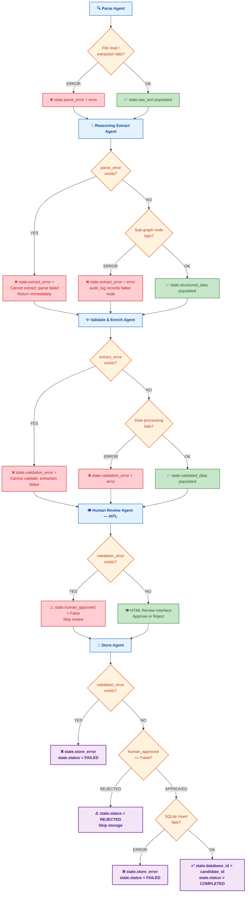
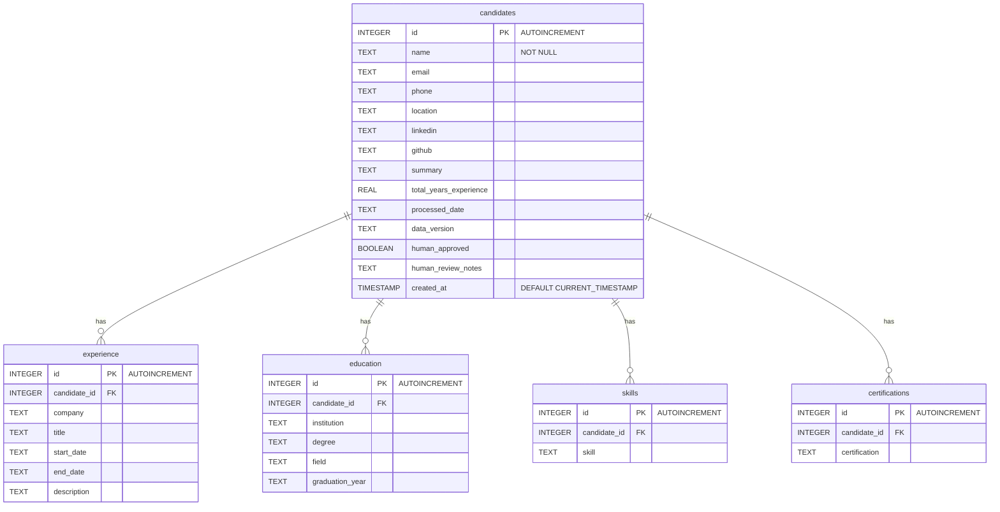
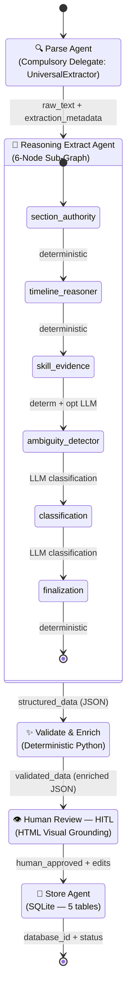
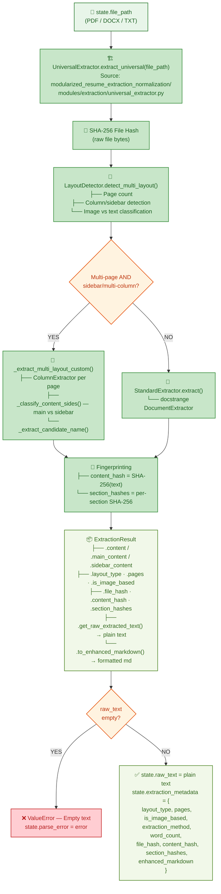
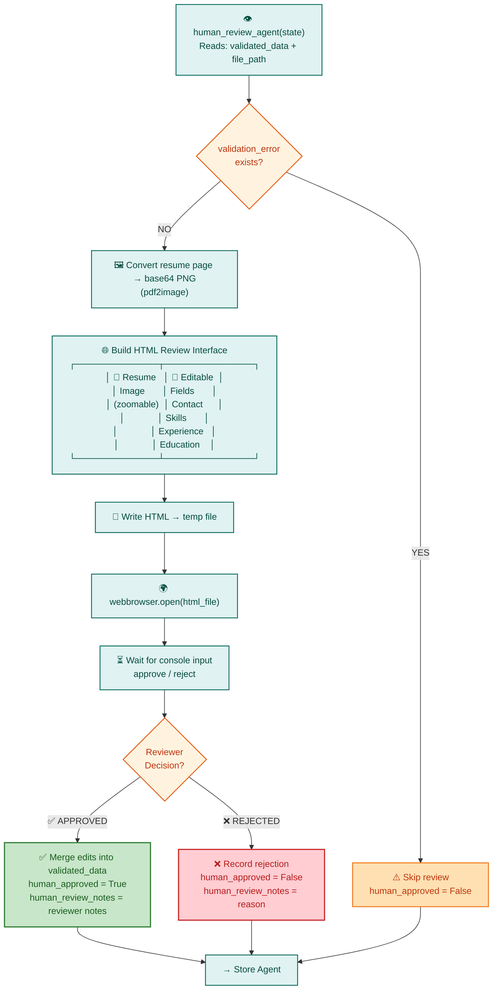
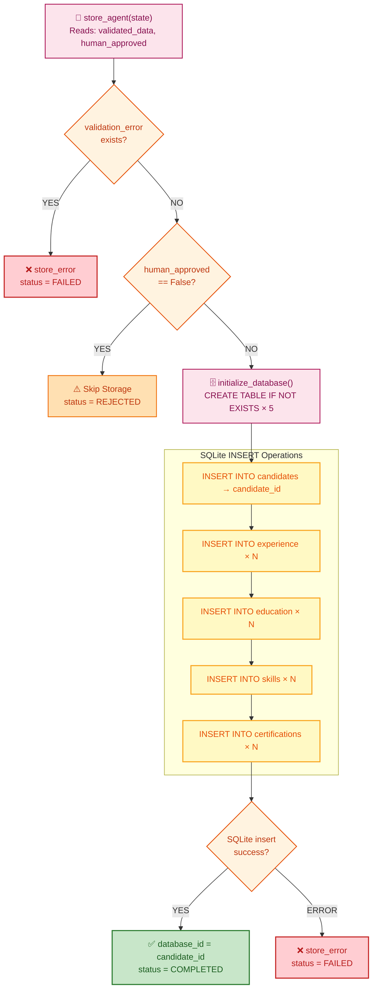

# Intelligent Resume Transformation Agent — Mermaid Workflow Diagrams

## Powered by LangGraph & Azure OpenAI Phi-4 LLM

---

## 1. Complete End-to-End Pipeline Workflow

```mermaid
flowchart TD
    %% ── Styles ──
    classDef startEnd fill:#1A73E8,stroke:#0D47A1,color:#fff,stroke-width:2px,font-weight:bold
    classDef initPhase fill:#E3F2FD,stroke:#1565C0,color:#0D47A1,stroke-width:1.5px
    classDef parseAgent fill:#E8F5E9,stroke:#2E7D32,color:#1B5E20,stroke-width:1.5px
    classDef universalExt fill:#C8E6C9,stroke:#388E3C,color:#1B5E20,stroke-width:1.5px
    classDef reasonAgent fill:#FFF3E0,stroke:#E65100,color:#BF360C,stroke-width:1.5px
    classDef deterministicNode fill:#C8E6C9,stroke:#2E7D32,color:#1B5E20,stroke-width:1.5px
    classDef llmNode fill:#FFCDD2,stroke:#C62828,color:#B71C1C,stroke-width:1.5px
    classDef optLlmNode fill:#FFF9C4,stroke:#F9A825,color:#E65100,stroke-width:1.5px
    classDef validateAgent fill:#F3E5F5,stroke:#6A1B9A,color:#4A148C,stroke-width:1.5px
    classDef hitlAgent fill:#E0F2F1,stroke:#00695C,color:#004D40,stroke-width:1.5px
    classDef storeAgent fill:#FCE4EC,stroke:#AD1457,color:#880E4F,stroke-width:1.5px
    classDef errorStyle fill:#FFCDD2,stroke:#C62828,color:#B71C1C,stroke-width:2px
    classDef decisionStyle fill:#FFF3E0,stroke:#E65100,color:#BF360C,stroke-width:1.5px
    classDef adapterStyle fill:#FFE0B2,stroke:#EF6C00,color:#BF360C,stroke-width:1.5px
    classDef validatorStyle fill:#E8EAF6,stroke:#283593,color:#1A237E,stroke-width:1.5px
    classDef resultStyle fill:#F1F8E9,stroke:#558B2F,color:#33691E,stroke-width:1.5px

    %% ══════════════════════════════════════════════════════════════
    %%  START
    %% ══════════════════════════════════════════════════════════════
    START(["🚀 START — Resume File Input<br/>(PDF / DOCX / TXT / RTF)"]):::startEnd

    %% ══════════════════════════════════════════════════════════════
    %%  PHASE 0: INITIALIZATION
    %% ══════════════════════════════════════════════════════════════
    START --> INIT

    subgraph INIT_PHASE["Phase 0: Initialization"]
        direction TB
        INIT["⚙️ Load .env Variables<br/>── AZURE_OPENAI_API_KEY<br/>── AZURE_OPENAI_ENDPOINT<br/>── AZURE_OPENAI_API_VERSION<br/>── AZURE_OPENAI_DEPLOYMENT_NAME = phi-4"]:::initPhase
        INIT --> CLIENT["🔌 Initialize AzureOpenAI Client<br/>(temperature=0, strict JSON mode)"]:::initPhase
        CLIENT --> GRAPH_BUILD["🔗 Create LangGraph StateGraph<br/>Compile: parse → reasoning_extract →<br/>validate_enrich → human_review → store → END"]:::initPhase
    end

    %% ══════════════════════════════════════════════════════════════
    %%  PHASE 1: STATE SCHEMA
    %% ══════════════════════════════════════════════════════════════
    GRAPH_BUILD --> STATE_DEF

    subgraph STATE_PHASE["Phase 1: State Schema Definition"]
        STATE_DEF["📋 Define ResumeState TypedDict<br/>── file_path, file_type<br/>── raw_text, parse_error<br/>── extraction_metadata<br/>── structured_data, extract_error<br/>── validated_data, validation_error<br/>── human_approved, human_review_notes<br/>── database_id, store_error<br/>── status, messages list"]:::initPhase
    end

    %% ══════════════════════════════════════════════════════════════
    %%  PHASE 2: PARSE AGENT
    %% ══════════════════════════════════════════════════════════════
    STATE_DEF --> PARSE_START

    subgraph PARSE_PHASE["Phase 2: Parse Agent — Compulsory Delegate to UniversalExtractor"]
        direction TB
        PARSE_START["🔍 parse_agent(state)<br/>LangGraph Node<br/>Reads: state.file_path"]:::parseAgent

        PARSE_START --> SYSPATH["📂 Add extraction pipeline to sys.path<br/>modularized_resume_extraction_normalization/"]:::parseAgent

        SYSPATH --> INIT_UE["🏗️ Initialize UniversalExtractor<br/>UniversalExtractor(use_gpu=False,<br/>use_neural_ocr=False)"]:::parseAgent

        %% ── UniversalExtractor Internal ──
        INIT_UE --> UE_CALL

        subgraph UE_BOX["UniversalExtractor.extract_universal(file_path)"]
            direction TB
            UE_CALL["🔐 Step 0: File Identity Hash<br/>SHA-256 of raw file bytes"]:::universalExt
            UE_CALL --> LAYOUT["🔎 Step 1: LayoutDetector.detect_multi_layout()<br/>── Page count analysis<br/>── Column/sidebar pattern detection<br/>── Image vs text classification"]:::universalExt

            LAYOUT --> LAYOUT_DEC{"Multi-page AND<br/>multi-layout?<br/>(sidebar / multi-column)"}:::decisionStyle

            LAYOUT_DEC -->|"YES"| MULTI["📐 _extract_multi_layout_custom()<br/>── ColumnExtractor per page<br/>── _classify_content_sides()<br/>── _extract_candidate_name()"]:::universalExt
            LAYOUT_DEC -->|"NO"| STD["📄 StandardExtractor.extract()<br/>── docstrange DocumentExtractor<br/>(single-page any layout OR<br/>multi-page single-column)"]:::universalExt

            MULTI --> FINGERPRINT
            STD --> FINGERPRINT

            FINGERPRINT["🔏 Step 3: Fingerprinting<br/>── content_hash = SHA-256(raw_text)<br/>── section_hashes = per-section SHA-256"]:::universalExt
            FINGERPRINT --> EXT_RESULT["📦 ExtractionResult<br/>── .content / .main_content / .sidebar_content<br/>── .layout_type, .pages, .is_image_based<br/>── .file_hash, .content_hash, .section_hashes<br/>── .get_raw_extracted_text() → plain text<br/>── .to_enhanced_markdown() → formatted md"]:::resultStyle
        end

        EXT_RESULT --> PARSE_CHECK{"raw_text is<br/>empty or None?"}:::decisionStyle
        PARSE_CHECK -->|"YES"| PARSE_ERR["❌ ValueError<br/>state.parse_error = error<br/>state.raw_text = None"]:::errorStyle
        PARSE_CHECK -->|"NO"| PARSE_OK["✅ Populate State<br/>state.raw_text = get_raw_extracted_text()<br/>state.parse_error = None<br/>state.extraction_metadata = {<br/>  layout_type, pages, is_image_based,<br/>  extraction_method, word_count,<br/>  file_hash, content_hash,<br/>  section_hashes, enhanced_markdown<br/>}"]:::resultStyle
    end

    %% ══════════════════════════════════════════════════════════════
    %%  PHASE 3: REASONING EXTRACT AGENT
    %% ══════════════════════════════════════════════════════════════
    PARSE_OK --> REASON_START
    PARSE_ERR --> REASON_START

    subgraph REASON_PHASE["Phase 3: Reasoning Extract Agent — Multi-Node Reasoning Graph"]
        direction TB
        REASON_START["🧠 reasoning_extract_agent(state)<br/>LangGraph Node<br/>Source: pipeline_bridge.py"]:::reasonAgent

        REASON_START --> REASON_ERR_CHECK{"parse_error<br/>exists?"}:::decisionStyle
        REASON_ERR_CHECK -->|"YES"| REASON_SKIP["❌ Set extract_error<br/>Cannot extract: parse failed<br/>Return state"]:::errorStyle

        REASON_ERR_CHECK -->|"NO"| ADAPTER_IN

        %% ── Adapter In ──
        subgraph ADAPTER_IN_BOX["Extraction Adapter (In) — extraction_adapter.py"]
            ADAPTER_IN["🔄 extraction_result_to_reasoning_state()<br/>── split_sections() — regex-based<br/>── extract_roles_deterministic() — patterns<br/>── extract_skills_deterministic() — delimiters<br/>── Contact parsing — regex (email, phone, LinkedIn)"]:::adapterStyle
            ADAPTER_IN --> RSTATE["📋 ReasoningState Initialized<br/>── content_hash, raw_text<br/>── sections, roles, skills<br/>── audit_log: empty list"]:::adapterStyle
        end

        %% ── 6-Node Sub-Graph ──
        RSTATE --> N1

        subgraph SUBGRAPH_BOX["6-Node Reasoning Sub-Graph — graph_runner.py"]
            direction TB
            N1["🔒 Node 1: section_authority_node<br/>❌ No LLM — DETERMINISTIC<br/>── Validate experience claims ↔ sections<br/>── Append authority_flag to roles<br/>── Audit: log section authority decisions"]:::deterministicNode

            N1 --> TIMELINE_CHECK{"Roles have<br/>date info?"}:::decisionStyle
            TIMELINE_CHECK -->|"YES"| N2["⏱️ Node 2: timeline_reasoner_node<br/>❌ No LLM — DETERMINISTIC (Date Math)<br/>── Compute overlapping roles<br/>── Calculate total_months<br/>── Detect parallel employment inflation<br/>── Identify gaps between roles<br/>── Write: state.timeline_analysis"]:::deterministicNode
            TIMELINE_CHECK -->|"NO — skip"| N3

            N2 --> N3

            N3["🔗 Node 3: skill_evidence_node<br/>⚠️ DETERMINISTIC + Optional LLM<br/>── Map skills → role descriptions<br/>── Identify skill-without-usage<br/>── Optional LLM for ambiguous mappings<br/>── Write: state.normalized_skills"]:::optLlmNode

            N3 --> N4["🔍 Node 4: ambiguity_detector_node<br/>✅ LLM CLASSIFICATION — Azure OpenAI Phi-4<br/>── Send pre-extracted phrases to LLM<br/>── Detect: worked on, familiar with,<br/>   knowledge of, exposure to<br/>── Prompt: ambiguity_prompt.txt (<200 tokens)<br/>── Write: state.ambiguities list"]:::llmNode

            N4 --> N5["🏷️ Node 5: classification_node<br/>✅ LLM CLASSIFICATION — Azure OpenAI Phi-4<br/>── Send skills + context to LLM<br/>── Tag: professional / academic /<br/>   cert-only / tool-only<br/>── Prompt: classification_prompt.txt (<200 tokens)<br/>── Write: state.confidence_flags"]:::llmNode

            N5 --> N6["🔐 Node 6: finalization_node<br/>❌ No LLM — DETERMINISTIC<br/>── Lock state (no further mutations)<br/>── Append complete audit trail entry<br/>── Return finalized ReasoningState"]:::deterministicNode
        end

        %% ── Validators ──
        N6 --> VALIDATORS

        subgraph VALIDATOR_BOX["Validators — run after every node"]
            VALIDATORS["🛡️ schema_validator.py — enforce schema<br/>🕵️ hallucination_detector.py — flag invented data<br/>🔍 consistency_checker.py — cross-validate"]:::validatorStyle
        end

        %% ── Adapter Out ──
        VALIDATORS --> ADAPTER_OUT

        subgraph ADAPTER_OUT_BOX["Extraction Adapter (Out) — extraction_adapter.py"]
            ADAPTER_OUT["🔄 reasoning_state_to_structured_data()<br/>── Map ReasoningState → structured_data format<br/>── Include timeline_analysis, ambiguities,<br/>   confidence_flags, audit_log<br/>── Compatible with validate_and_enrich_agent"]:::adapterStyle
        end

        ADAPTER_OUT --> REASON_OK["✅ state.structured_data = {<br/>  contact, summary, experience[],<br/>  education[], skills[], certifications[],<br/>  timeline_analysis, ambiguities,<br/>  confidence_flags, audit_log<br/>}<br/>state.extract_error = None"]:::resultStyle
    end

    %% ══════════════════════════════════════════════════════════════
    %%  PHASE 4: VALIDATE & ENRICH AGENT
    %% ══════════════════════════════════════════════════════════════
    REASON_OK --> VAL_START
    REASON_SKIP --> VAL_START

    subgraph VALIDATE_PHASE["Phase 4: Validate & Enrich Agent — Deterministic Python"]
        direction TB
        VAL_START["✨ validate_and_enrich_agent(state)<br/>LangGraph Node<br/>Reads: state.structured_data"]:::validateAgent

        VAL_START --> VAL_ERR_CHECK{"extract_error<br/>exists?"}:::decisionStyle
        VAL_ERR_CHECK -->|"YES"| VAL_SKIP["❌ Set validation_error<br/>Cannot validate: extraction failed"]:::errorStyle

        VAL_ERR_CHECK -->|"NO"| CLEAN["🧹 1. clean_contact_info(contact)<br/>── Validate email (must contain @)<br/>── Clean phone (strip non-numeric)<br/>── Strip whitespace"]:::validateAgent

        CLEAN --> CALC_EXP["📅 2. calculate_experience(experience_list)<br/>── parse_date() for start/end dates<br/>── Sum months across positions<br/>── Convert → years (1 decimal)<br/>── Present → datetime.now()"]:::validateAgent

        CALC_EXP --> STD_SKILLS["🔧 3. standardize_skills(skills)<br/>── Lowercase lookup → STANDARD_SKILLS taxonomy<br/>── Deduplicate (reactjs + react → React)<br/>── Sort alphabetically"]:::validateAgent

        STD_SKILLS --> ADD_META["📎 4. Add Metadata<br/>── processed_date = ISO-8601<br/>── data_version = 1.0"]:::validateAgent

        ADD_META --> VAL_OK["✅ state.validated_data = enriched JSON<br/>state.validation_error = None"]:::resultStyle
    end

    %% ══════════════════════════════════════════════════════════════
    %%  PHASE 5: HUMAN REVIEW (HITL)
    %% ══════════════════════════════════════════════════════════════
    VAL_OK --> HITL_START
    VAL_SKIP --> HITL_START

    subgraph HITL_PHASE["Phase 5: Human Review Agent — Visual Grounding (HITL)"]
        direction TB
        HITL_START["👁️ human_review_agent(state)<br/>LangGraph Node<br/>Reads: state.validated_data, state.file_path"]:::hitlAgent

        HITL_START --> HITL_ERR_CHECK{"validation_error<br/>exists?"}:::decisionStyle
        HITL_ERR_CHECK -->|"YES"| HITL_SKIP["⚠️ Skip review<br/>state.human_approved = False"]:::errorStyle

        HITL_ERR_CHECK -->|"NO"| GEN_IMG["🖼️ 1. Generate Resume Image<br/>pdf2image → base64 PNG"]:::hitlAgent

        GEN_IMG --> BUILD_HTML["🌐 2. Build HTML Review Interface<br/>── Left panel: Resume image (zoomable)<br/>── Right panel: Editable fields<br/>   (contact, skills, experience, education)"]:::hitlAgent

        BUILD_HTML --> WRITE_HTML["📂 3. Write HTML to temp file"]:::hitlAgent
        WRITE_HTML --> OPEN_BROWSER["🌍 4. Open in Browser<br/>webbrowser.open(html_file)"]:::hitlAgent
        OPEN_BROWSER --> WAIT_INPUT["⏳ 5. Wait for Reviewer Decision<br/>Console input: approve / reject"]:::hitlAgent

        WAIT_INPUT --> HITL_DEC{"Reviewer<br/>Decision?"}:::decisionStyle
        HITL_DEC -->|"✅ APPROVED"| HITL_APPROVE["✅ Merge Edits into validated_data<br/>state.human_approved = True<br/>state.human_review_notes = notes"]:::resultStyle
        HITL_DEC -->|"❌ REJECTED"| HITL_REJECT["❌ Record Rejection<br/>state.human_approved = False<br/>state.human_review_notes = reason"]:::errorStyle
    end

    %% ══════════════════════════════════════════════════════════════
    %%  PHASE 6: STORE AGENT
    %% ══════════════════════════════════════════════════════════════
    HITL_APPROVE --> STORE_START
    HITL_REJECT --> STORE_START
    HITL_SKIP --> STORE_START

    subgraph STORE_PHASE["Phase 6: Store Agent — SQLite Database"]
        direction TB
        STORE_START["💾 store_agent(state)<br/>LangGraph Node<br/>Reads: state.validated_data, state.human_approved"]:::storeAgent

        STORE_START --> STORE_VAL_CHECK{"validation_error<br/>exists?"}:::decisionStyle
        STORE_VAL_CHECK -->|"YES"| STORE_FAIL["❌ store_error<br/>status = failed"]:::errorStyle

        STORE_VAL_CHECK -->|"NO"| STORE_APPROVE_CHECK{"human_approved<br/>== False?"}:::decisionStyle
        STORE_APPROVE_CHECK -->|"YES — rejected"| STORE_REJECTED["⚠️ Skip Storage<br/>status = rejected"]:::errorStyle

        STORE_APPROVE_CHECK -->|"NO — approved"| INIT_DB["🗄️ initialize_database()<br/>CREATE TABLE IF NOT EXISTS:<br/>── candidates (PK: id)<br/>── experience (FK: candidate_id)<br/>── education (FK: candidate_id)<br/>── skills (FK: candidate_id)<br/>── certifications (FK: candidate_id)"]:::storeAgent

        INIT_DB --> INSERT_DATA["💿 INSERT Records<br/>── candidates → candidate_id<br/>── experience × N entries<br/>── education × N entries<br/>── skills × N entries<br/>── certifications × N entries"]:::storeAgent

        INSERT_DATA --> STORE_OK["✅ state.database_id = candidate_id<br/>state.status = completed"]:::resultStyle
    end

    %% ══════════════════════════════════════════════════════════════
    %%  PHASE 7-9: RESULTS
    %% ══════════════════════════════════════════════════════════════
    STORE_OK --> SUMMARY
    STORE_FAIL --> SUMMARY
    STORE_REJECTED --> SUMMARY

    subgraph SUMMARY_PHASE["Phase 7–9: Results Summary & Query"]
        SUMMARY["📊 Workflow Summary<br/>── Print all messages<br/>── Final Status: COMPLETED / REJECTED / FAILED<br/>── Database ID (if stored)<br/>── Human Review: ✓ APPROVED / ✗ REJECTED"]:::initPhase
        SUMMARY --> QUERY["🔎 query_database()<br/>SELECT from candidates<br/>ORDER BY created_at DESC"]:::initPhase
    end

    QUERY --> FINISH(["🏁 END"]):::startEnd
```

---

## 2. Reasoning Sub-Graph Internal Flow (Detailed)

```mermaid
flowchart TD
    classDef inputOutput fill:#E3F2FD,stroke:#1565C0,color:#0D47A1,stroke-width:2px
    classDef adapter fill:#FFE0B2,stroke:#EF6C00,color:#BF360C,stroke-width:1.5px
    classDef determ fill:#C8E6C9,stroke:#2E7D32,color:#1B5E20,stroke-width:1.5px
    classDef llm fill:#FFCDD2,stroke:#C62828,color:#B71C1C,stroke-width:1.5px
    classDef optLlm fill:#FFF9C4,stroke:#F9A825,color:#E65100,stroke-width:1.5px
    classDef validator fill:#E8EAF6,stroke:#283593,color:#1A237E,stroke-width:1.5px
    classDef decision fill:#FFF3E0,stroke:#E65100,color:#BF360C,stroke-width:1.5px

    IN(["📥 Input from Parse Agent<br/>raw_text + content_hash<br/>(via pipeline_bridge.py)"]):::inputOutput

    IN --> AIN

    subgraph ADAPTER_IN["Extraction Adapter In — extraction_adapter.py"]
        AIN["🔄 extraction_result_to_reasoning_state()<br/>── split_sections() — regex<br/>── extract_roles_deterministic() — patterns<br/>── extract_skills_deterministic() — delimiters<br/>── Contact parsing — regex"]:::adapter
        AIN --> RSINIT["📋 ReasoningState Initialized<br/>content_hash · raw_text · sections<br/>roles · skills · audit_log: empty"]:::adapter
    end

    RSINIT --> NODE1

    subgraph SUBGRAPH["6-Node LangGraph Sub-Graph — graph_runner.py"]
        direction TB
        NODE1["🔒 Node 1: section_authority_node<br/>❌ DETERMINISTIC — No LLM<br/>• Validate experience claims ↔ correct sections<br/>• Flag claims in wrong sections<br/>• Append authority_flag to each role<br/>• Audit: log section authority decisions"]:::determ

        NODE1 --> TC{"Roles have<br/>date info?"}:::decision

        TC -->|"YES"| NODE2["⏱️ Node 2: timeline_reasoner_node<br/>❌ DETERMINISTIC — Pure Date Math<br/>• Compute overlapping roles<br/>• Calculate total_months<br/>• Detect parallel employment inflation<br/>• Identify gaps between roles<br/>• Write timeline_analysis"]:::determ

        TC -->|"NO — skip"| NODE3

        NODE2 --> NODE3

        NODE3["🔗 Node 3: skill_evidence_node<br/>⚠️ DETERMINISTIC + Optional LLM<br/>• Map each skill → role descriptions<br/>• Identify skill-without-usage<br/>• Optional LLM for ambiguous mappings<br/>• Write normalized_skills with evidence"]:::optLlm

        NODE3 --> NODE4["🔍 Node 4: ambiguity_detector_node<br/>✅ LLM CLASSIFICATION<br/>Azure OpenAI Phi-4 (temp=0, JSON)<br/>• Send pre-extracted phrases to LLM<br/>• Detect vague/non-committal language<br/>• Prompt: ambiguity_prompt.txt < 200 tokens<br/>• Write ambiguities list"]:::llm

        NODE4 --> NODE5["🏷️ Node 5: classification_node<br/>✅ LLM CLASSIFICATION<br/>Azure OpenAI Phi-4 (temp=0, JSON)<br/>• Send skills + context to LLM<br/>• Tag: professional / academic /<br/>  cert-only / tool-only<br/>• Prompt: classification_prompt.txt < 200 tokens<br/>• Write confidence_flags"]:::llm

        NODE5 --> NODE6["🔐 Node 6: finalization_node<br/>❌ DETERMINISTIC — No LLM<br/>• Lock state — prevent further mutation<br/>• Append complete audit trail entry<br/>• Return finalized ReasoningState"]:::determ
    end

    NODE6 --> VALBOX

    subgraph VALIDATORS["Validators — run after every node"]
        VALBOX["🛡️ schema_validator.py<br/>No unknown keys · required fields · type checks<br/><br/>🕵️ hallucination_detector.py<br/>Skills/roles not in raw_text → flagged or removed<br/><br/>🔍 consistency_checker.py<br/>Experience years vs timeline · skills vs roles"]:::validator
    end

    VALBOX --> AOUT

    subgraph ADAPTER_OUT["Extraction Adapter Out — extraction_adapter.py"]
        AOUT["🔄 reasoning_state_to_structured_data()<br/>── ReasoningState → structured_data<br/>── Include reasoning metadata<br/>── Compatible with validate_and_enrich_agent"]:::adapter
    end

    AOUT --> OUT(["📤 Output → state.structured_data<br/>{contact, summary, experience[],<br/>education[], skills[], certifications[],<br/>timeline_analysis, ambiguities,<br/>confidence_flags, audit_log}"]):::inputOutput
```

---

## 3. Error Propagation Flow

---

## 4. Cross-Pipeline Integration

```mermaid
flowchart LR
    classDef pipeline1 fill:#E3F2FD,stroke:#1565C0,color:#0D47A1,stroke-width:2px
    classDef pipeline2 fill:#FFF3E0,stroke:#E65100,color:#BF360C,stroke-width:2px
    classDef component fill:#FFFFFF,stroke:#1565C0,color:#0D47A1,stroke-width:1px
    classDef dbStyle fill:#FFF9C4,stroke:#F9A825,color:#E65100,stroke-width:2px
    classDef cloudStyle fill:#FFCDD2,stroke:#C62828,color:#B71C1C,stroke-width:2px

    subgraph P1["Pipeline 1: modularized_resume_extraction_normalization<br/>(Deterministic Extraction — Docstrange + Layout Detection)"]
        direction TB
        FILE["📄 Resume File<br/>(PDF/DOCX/TXT/RTF)"]:::component
        UE["🏗️ UniversalExtractor<br/>(universal_extractor.py)"]:::component
        LD["🔎 LayoutDetector<br/>(layout_detector.py)"]:::component
        CE["📐 ColumnExtractor<br/>(column_extractor.py)"]:::component
        SE["📄 StandardExtractor<br/>(standard_extraction.py)"]:::component
        HF["📝 HeadingFormatter<br/>(heading_formatter.py)"]:::component
        HA["🔏 Hashing<br/>(hashing.py)"]:::component
        ER["📦 ExtractionResult<br/>(extraction_models.py)"]:::component

        FILE --> UE
        UE --> LD
        LD -->|"multi-layout"| CE
        LD -->|"standard"| SE
        CE --> HF
        SE --> HF
        HF --> HA
        HA --> ER
    end

    subgraph P2["Pipeline 2: modularized_resume_parsing_agent<br/>(LangGraph + Azure OpenAI Phi-4)"]
        direction TB
        PA["🔍 Parse Agent<br/>(Compulsory Delegate)"]:::component
        RA["🧠 Reasoning Extract<br/>(6-Node Sub-Graph)"]:::component

        subgraph NODES["Reasoning Nodes"]
            direction TB
            RN1["section_authority ❌"]:::component
            RN2["timeline_reasoner ❌"]:::component
            RN3["skill_evidence ⚠️"]:::component
            RN4["ambiguity_detector ✅"]:::component
            RN5["classification ✅"]:::component
            RN6["finalization ❌"]:::component
            RN1 --> RN2 --> RN3 --> RN4 --> RN5 --> RN6
        end

        VA["✨ Validate & Enrich<br/>(Deterministic Python)"]:::component
        HR["👁️ Human Review — HITL<br/>(HTML Interface)"]:::component
        SA["💾 Store Agent<br/>(SQLite)"]:::component

        PA --> RA
        RA --> NODES
        RN6 --> VA
        VA --> HR
        HR --> SA
    end

    LLM["☁️ Azure OpenAI<br/>Phi-4 Model<br/>(classification only)"]:::cloudStyle

    DB[("🗄️ resume_ats.db<br/>SQLite<br/>── candidates<br/>── experience<br/>── education<br/>── skills<br/>── certifications")]:::dbStyle

    ER -->|"get_raw_extracted_text()<br/>content_hash"| PA
    RN4 -.->|"classification call<br/>< 200 tokens"| LLM
    RN5 -.->|"classification call<br/>< 200 tokens"| LLM
    SA -->|"INSERT INTO<br/>5 normalised tables"| DB
```

---

## 5. Database Schema (Entity Relationship)

---

## 6. High-Level Workflow (Simplified State Diagram)

---

## 7. Parse Agent — UniversalExtractor Delegation Detail

---

## 8. HITL Human Review Decision Flow

---

## 9. Store Agent Decision Flow

---

> **How to Render:** Paste any of the Mermaid code blocks into:
> - [Mermaid Live Editor](https://mermaid.live/)
> - GitHub / GitLab markdown (native support)
> - VS Code with the **Markdown Preview Mermaid Support** extension
> - Any Mermaid-compatible documentation tool (Notion, Confluence, Docusaurus, etc.)
