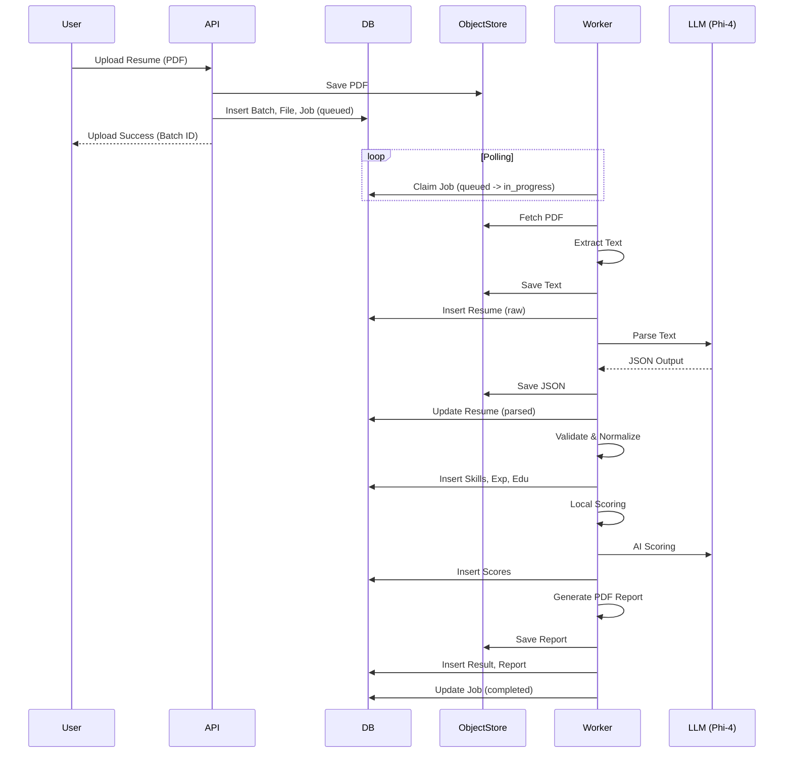

# Resume Parser Pipeline Flow

This document details the end-to-end flow of the Resume Parser & Orchestrator pipeline, mapping the user journey to system components, database state changes, and object storage operations.

## 1. High-Level Architecture

The system follows an asynchronous, event-driven architecture where the **API** handles ingestion and the **Worker** handles heavy processing.

```mermaid
graph TD
    User[User / Recruiter] -->|Uploads Resume| API[API Server]
    API -->|1. Store File| ObjStore[Object Store (S3/MinIO)]
    API -->|2. Create Batch/File| DB[(PostgreSQL)]
    API -->|3. Enqueue Job| DB
    
    subgraph Worker Node
        Worker[Worker Process] -->|4. Poll Job| DB
        Worker -->|5. Fetch File| ObjStore
        Worker -->|6. Extract Text| Extractor[Text Extractor]
        Worker -->|7. Parse (AI)| Parser[Azure Phi-4]
        Worker -->|8. Validate| Validator[Validator]
        Worker -->|9. Score| Scorer[AI & Local Scorer]
        Worker -->|10. Generate Report| Reporter[PDF Generator]
    end
    
    Worker -->|11. Save Checkpoints| DB
    Worker -->|12. Save Results| DB
    Worker -->|13. Store Artifacts| ObjStore
```

## 2. Detailed Step-by-Step Flow

### Phase 1: Ingestion (Synchronous)

1.  **Upload**: User uploads a batch of PDF resumes via the Frontend.
2.  **File Storage**:
    *   Server calculates `SHA256` checksum.
    *   Checks `files` table for duplicates.
    *   Uploads file to Object Store (`/uploads/{tenant_id}/{batch_id}/{filename}`).
3.  **DB Records**:
    *   Creates `batches` record (Status: `created`).
    *   Creates `files` records.
    *   Creates `jobs` records for each file (Status: `queued`).

### Phase 2: Processing (Asynchronous Worker)

The Worker continuously polls for `queued` jobs.

#### Step 1: Job Claiming
*   **Action**: Worker finds oldest `queued` job.
*   **DB Update**: Atomic UPDATE `jobs` SET `status`='in_progress', `worker_id`={self}, `started_at`=NOW().

#### Step 2: Extraction
*   **Input**: Raw PDF from Object Store.
*   **Process**: Uses `pdfplumber` / OCR to extract text.
*   **Artifact**: `resume_text.txt` saved to Object Store.
*   **DB Update**:
    *   Create `resumes` record (Status: `raw`).
    *   Update `resumes.raw_text_path`.
    *   Create `checkpoints` (Step: `extraction`).

#### Step 3: Normalization & Parsing
*   **Input**: Extracted text.
*   **Process**:
    *   Clean and normalize text (Markdown formatting).
    *   Send to **Azure Phi-4** (LLM) for structured extraction.
*   **Artifact**: `parsed_resume.json` saved to Object Store.
*   **DB Update**:
    *   Update `resumes.parsed_json_path`.
    *   Create `checkpoints` (Step: `parsing`).

#### Step 4: Validation & Persistence
*   **Input**: Parsed JSON.
*   **Process**:
    *   Validate schema (dates, email format, required fields).
    *   Canonicalize skills and company names.
*   **DB Update**:
    *   Populate normalized tables: `resume_experiences`, `resume_skills`, `resume_education`, `resume_projects`.
    *   Update `resumes` Status -> `validated`.
    *   Create `checkpoints` (Step: `validation`).

#### Step 5: Scoring (Dual-Engine)
*   **Input**: Validated Resume Data + Job Description (JD).
*   **Process**:
    1.  **Local Matcher**: Keyword/Regex matching (Deterministic).
    2.  **AI Scorer**: LLM evaluation of qualitative fit (Reasoning).
*   **Artifacts**: `local_score.json`, `ai_score.json`.
*   **DB Update**:
    *   Insert `local_match_scores`.
    *   Insert `ai_scores`.
    *   Create `checkpoints` (Step: `scoring`).

#### Step 6: Reporting & Completion
*   **Process**: Generate PDF Report and Summary.
*   **Artifact**: `report.pdf`.
*   **DB Update**:
    *   Insert `results` (linking Job, Resume, Scores).
    *   Insert `reports`.
    *   Update `jobs` Status -> `completed`.
    *   Update `batches` progress counters.

## 3. Data State Transitions

The `jobs` table drives the lifecycle.

| Job Status | Trigger | Next Action |
| :--- | :--- | :--- |
| `queued` | File Uploaded | Waiting for Worker |
| `in_progress` | Worker Claim | Pipeline Execution |
| `completed` | Pipeline Success | Available in Results UI |
| `failed` | Exception | Retry or Manual Review |

The `resumes` table tracks the candidate data maturity.

| Resume Status | Description | Data Available |
| :--- | :--- | :--- |
| `raw` | Text extracted | `raw_text_path` |
| `parsed` | LLM processed | `parsed_json_path` |
| `validated` | Schema checked | `resume_skills`, `resume_experiences` tables populated |
| `scored` | Evaluated vs JD | `local_match_scores`, `ai_scores` populated |

## 4. Sequence Diagram



## 5. Failure Handling

*   **Retries**: If a step fails, the worker catches the exception, logs to `error_logs`, and increments `jobs.attempts`. If `attempts < MAX_RETRIES`, status resets to `queued`.
*   **Idempotency**: Each step checks for existing artifacts in Object Store before computing, allowing resume-from-checkpoint.
*   **Dead Letter**: If `attempts >= MAX_RETRIES`, job status becomes `failed`.
