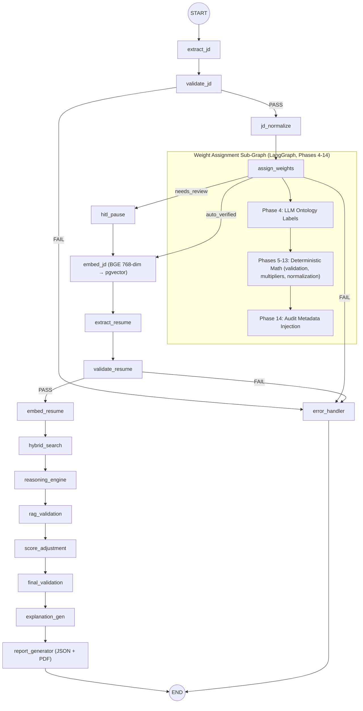

# RAIYA Backend — Complete v8.0 Workflow

> **AI-Powered Resume Screening Backend** by SpeedTech.ai
> FastAPI · LangGraph · PostgreSQL 16 + pgvector · Azure Phi-4 · SMTP Email Notifications
>
> **Runtime target:** LangGraph **0.6.x**, async runtime, **`AsyncPostgresSaver`** checkpointer.
> All nodes are `async def`. Runtime dependencies (DB, Redis, embedder, OCR, LLM, SMTP) are injected via `context_schema` + `Runtime[PipelineContext]` — not module globals. `config_schema` is deprecated in 0.6.0 and must not be used.

---

## Architecture Overview

```
┌─────────────────────────────────────────────────────────────────────┐
│                    RAIYA Backend v8.0                                │
│                                                                     │
│  ┌──────────┐   ┌──────────┐   ┌──────────────────────────────────┐│
│  │ FastAPI   │──▶│ LangGraph│──▶│ PostgreSQL 16 + pgvector        ││
│  │ REST API  │   │ Pipeline │   │ Redis Cache · Alembic Migrations││
│  └──────────┘   └──────────┘   └──────────────────────────────────┘│
│                                                                     │
│  4-Pipeline Architecture:                                           │
│    P1: JD Processing → P2: Resume Processing                       │
│    P3: Scoring + Validation → P4: Interview Email (HR-only)        │
│                                                                     │
│  Memory Persistence: LangGraph AsyncPostgresSaver + Pipeline Memory │
│  Email: aiosmtplib + Jinja2 templates (HR notifications only)      │
└─────────────────────────────────────────────────────────────────────┘
```

---

## Directory Structure

```
raiya-resume-scoring-backend/
├── app/                                    # Main backend application
│   ├── main.py                             # FastAPI entry point (async lifespan: AsyncPostgresSaver + build_graph + app.state.graph + /health surfaces graph_ready)
│   ├── agents/                             # LangGraph pipeline (v0.6.x, async)
│   │   ├── __init__.py                     # PipelineState TypedDict (P1–P3 fields) + PipelineContext TypedDict (runtime deps)
│   │   ├── agent_controller.py             # build_graph() — StateGraph(state_schema=PipelineState, context_schema=PipelineContext); interrupt_before=["hitl_pause"]
│   │   ├── agent_authority.py              # Permission checks
│   │   ├── agent_guardrails.py             # Guardrails AI integration
│   │   ├── nodes/                          # All nodes: async def node(state, runtime: Runtime[PipelineContext]) -> dict
│   │   │   ├── pipeline1/                  # Resume Processing (legacy dir name; runs after JD per topology)
│   │   │   │   ├── extract_resume.py       # OCR + resume_schema_validation
│   │   │   │   ├── validate_resume.py      # Pydantic enforcement
│   │   │   │   └── embed_resume.py         # BGE-large-en-v1.5 embeddings
│   │   │   ├── pipeline2/                  # JD Processing (legacy dir name; runs first per topology)
│   │   │   │   ├── extract_jd.py           # OCR + JD_EXTRACTION_SCHEMA
│   │   │   │   ├── validate_jd.py          # Schema enforcement
│   │   │   │   ├── jd_normalize.py         # Alias normalization
│   │   │   │   ├── assign_weights.py       # Delegates to sub-graph
│   │   │   │   ├── weight_assignment_graph.py  # 14-phase sub-graph (Phases 4–14)
│   │   │   │   └── hitl_pause.py           # Compile-time interrupt; resume via Command(resume=...)
│   │   │   └── pipeline3/                  # Scoring + Validation
│   │   │       ├── hybrid_search.py        # Dense + BM25 + RRF
│   │   │       ├── reasoning_engine.py     # 5-phase reasoning
│   │   │       ├── rag_validation.py       # 8-step RAG (Pydantic-validated)
│   │   │       ├── score_adjustment.py     # Guardrails + corrections (Pydantic)
│   │   │       ├── final_validation.py     # PASS/FAIL gate (det_valid AND math_valid AND jd_weights_math_valid)
│   │   │       ├── explanation_gen.py      # LLM explanation
│   │   │       └── report_generator.py     # Final report (terminal node; no Pipeline-4 successor)
│   │   └── tools/
│   │       ├── ocr_tool.py                 # Nanonets DocStrange
│   │       ├── llm_tool.py                 # Azure Phi-4 (prompt caching)
│   │       ├── search_tool.py              # Hybrid search
│   │       └── embedding_tool.py           # BGE embeddings
│   ├── api/v1/                             # REST endpoints
│   │   └── routes/
│   │       ├── auth.py                     # Login/signup; /me uses get_current_user dependency
│   │       ├── jd.py, admin.py
│   │       ├── batch.py                    # /start dispatches background run_batch via BackgroundTasks
│   │       └── email.py                    # Interview email API (calls services/email_service, NOT the graph)
│   ├── core/                               # Config (+ SMTP settings), logging, hashing
│   │   └── security.py                     # JWT + OAuth2 bearer get_current_user dependency
│   ├── db/                                 # Database layer
│   │   ├── database.py                     # SQLAlchemy async+sync engines (async = FastAPI/nodes, sync = Alembic only)
│   │   ├── pgvector_client.py              # pgvector operations
│   │   ├── redis_client.py                 # Redis cache (module-level singleton)
│   │   └── memory_persistence.py           # open_async_checkpointer() ctx-mgr (AsyncPostgresSaver) + PipelineMemoryStore audit log
│   ├── guardrails_config/                  # Guardrails AI validators
│   ├── models/                             # SQLAlchemy ORM models
│   │   ├── user.py, document.py, batch.py, audit.py
│   │   └── interview.py                    # InterviewInvitation model (NEW)
│   ├── schemas/                            # Pydantic schemas (12 reference schemas)
│   │   ├── resume.py, jd.py, jd_weights.py, extracted_rules.py
│   │   ├── deterministic_output.py, mathematical_report.py
│   │   ├── rule_based_evidence.py, final_result.py
│   │   ├── final_validation_report.py, reasoning.py
│   │   ├── embedding_schemas.py            # JD/Resume/Evidence embeddings (NEW)
│   │   ├── interview_email.py              # Pipeline 4 schemas (NEW)
│   │   ├── batch.py, auth.py, admin.py
│   │   └── __init__.py                     # All schema exports
│   ├── services/                           # Business logic (one layer above the graph)
│   │   ├── auth_service.py, admin_service.py, token_usage_monitor.py
│   │   ├── batch_service.py                # create/add/status + run_batch(batch_id, graph, ctx) orchestrator
│   │   ├── jd_service.py                   # JD CRUD; persists JD bytes to storage/jd/<hash>.pdf
│   │   └── email_service.py                # aiosmtplib + Jinja2; send_interview_emails(batch_id) is the Pipeline 4 entry point
│   ├── reasoning/                          # 5-phase reasoning engine
│   ├── chunking/                           # JSON chunking for embeddings
│   └── RAG_Validation_layer/               # RAG evidence (pgvector)
│
├── storage/                                # Filesystem-backed byte storage (created by Dockerfile / dev mkdir)
│   ├── resumes/<hash>.pdf                  # Persisted by batch_service.add_resume_to_batch; read by run_batch._load_resume_bytes
│   ├── jd/<hash>.pdf                       # Persisted by jd_service.create_jd_from_upload; read by run_batch._load_jd_bytes
│   └── reports/<batch_id>/                 # PDFs written by report_generator_node
│
├── prompts/
│   ├── v2/                                 # LLM prompt templates
│   └── email_templates/                    # Jinja2 email templates (NEW)
│       └── interview_invitation.html.j2    # HR notification template
│
├── docker/Dockerfile                       # Container with PYTHONPATH set; creates storage/{resumes,jd,reports}
├── docker-compose.yml                      # postgres + redis (always); backend service under --profile backend
├── migrations/
│   ├── env.py                              # Alembic configuration
│   └── versions/
│       ├── 001_initial_schema.py           # Core tables + pgvector
│       ├── 002_weight_metadata_pgvector.py # Weight audit columns
│       └── 003_interview_invitations.py    # Interview + pipeline_memory (NEW)
├── reference_json_schema/                  # 12 canonical JSON schemas
└── requirements.txt                        # langgraph>=0.6.0,<0.7.0 + aiosmtplib, jinja2, langgraph-checkpoint-postgres
```

---

## LangGraph Pipeline Architecture

### Pipeline State (`PipelineState` TypedDict)

All nodes share a single `PipelineState` dict that flows through the graph:

| Field Group | Key Fields |
|:---|:---|
| **Identifiers** | `batch_id`, `resume_file_id`, `jd_id`, `session_id` |
| **Pipeline 1 (JD)** | `jd_extracted`, `jd_normalized`, `jd_weights`, `weights_hash`, `hitl_verified` |
| **Pipeline 2 (Resume)** | `resume_parsed`, `resume_content_hash`, `resume_chunks` |
| **Pipeline 3 (Scoring)** | `section_similarities`, `reasoning_labels`, `final_score` |
| **RAG** | `deterministic_report`, `mathematical_report`, `rag_final_verdict` |
| **Output** | `match_output`, `llm_explanation`, `report_path` |

Pipeline 4 (interview emails) is a batch-level operation outside the LangGraph graph and **does not** carry state in `PipelineState` — see the [Pipeline 4 section](#pipeline-4--interview-email-notification-hr-only).

**Concurrency invariant.** The per-resume graph is **sequential** — every field above is written by exactly one node before being read downstream, so plain `TypedDict` fields (last-write-wins semantics) are safe. The only fan-out point is the batch-level wrapper (see Pipeline 4 topology), where multiple per-resume runs execute under distinct `thread_id`s and never share state. If a future feature adds *intra-graph* parallel writes to the same key, that field must be annotated with a reducer, e.g. `Annotated[list, operator.add]` or a custom `(Value, Value) -> Value` per the StateGraph reference.

### Runtime Context (`PipelineContext` TypedDict)

Runtime dependencies are **not** module globals — they are injected via `context_schema` so they survive checkpoint resume and remain mockable in tests.

```python
from typing import TypedDict
from langgraph.graph import StateGraph
from langgraph.runtime import Runtime

class PipelineContext(TypedDict):
    db: "AsyncSession"           # SQLAlchemy async session factory or session
    redis: "Redis"               # redis.asyncio client
    embedder: "BGEEmbedder"      # BAAI/bge-large-en-v1.5 wrapper
    ocr: "NanonetsClient"        # DocStrange client
    llm: "AzurePhi4Client"       # Azure inference client
    smtp: "AiosmtplibClient"     # Pipeline 4 only
    settings: "Settings"         # pydantic-settings instance (thresholds, flags)

builder = StateGraph(state_schema=PipelineState, context_schema=PipelineContext)
```

**Every node signature** is therefore:

```python
async def extract_jd(state: PipelineState, runtime: Runtime[PipelineContext]) -> dict:
    ocr = runtime.context["ocr"]
    redis = runtime.context["redis"]
    ...
    return {"jd_extracted": ..., "weights_hash": ...}
```

Nodes return a `dict` of state *deltas* — never the full state. The LangGraph runtime merges deltas via the channel reducers.

### `thread_id` ↔ `session_id`

LangGraph's checkpointer keys on `config["configurable"]["thread_id"]`. RAIYA uses `session_id` as the application-level identifier. **They are the same value** — FastAPI endpoints always invoke the graph with:

```python
config = {"configurable": {"thread_id": state["session_id"]}}
await graph.ainvoke(state, context=ctx, config=config)
```

The `pipeline_memory.session_id` column (audit log) and the LangGraph `checkpoints.thread_id` column will always carry identical values for a given run.

### Graph Topology



### Branching: `add_conditional_edges` routers

Every labelled Mermaid edge above is implemented by a **router function** wired through `add_conditional_edges(<from>, <router>, {label: <to>, ...})` — *not* by mutating state inside the node body. Router functions take `state` (and optionally `runtime`) and return one of the label strings. Each router below reads only the fields it owns; never the full state.

| From node | Router | Reads | Returns | Edge map |
|---|---|---|---|---|
| `validate_jd` | `route_jd_validation` | `state["jd_extracted"]`, validation report flag | `"PASS"` \| `"FAIL"` | `{"PASS": "jd_normalize", "FAIL": "error_handler"}` |
| `assign_weights` | `route_weights_outcome` | `state["jd_weights"]`, `state["weights_confidence"]`, math-valid flag | `"auto_verified"` \| `"needs_review"` \| `"FAIL"` | `{"auto_verified": "embed_jd", "needs_review": "hitl_pause", "FAIL": "error_handler"}` |
| `hitl_pause` | (no router — single edge) | n/a | n/a | unconditional → `embed_jd` (only reached after `Command(resume=...)`) |
| `validate_resume` | `route_resume_validation` | `state["resume_parsed"]` validity | `"PASS"` \| `"FAIL"` | `{"PASS": "embed_resume", "FAIL": "error_handler"}` |

`report_generator` has no router — it is the terminal node and always edges unconditionally to `END`. Pipeline 4's batch email dispatch is a service called outside the graph (see [Pipeline 4](#pipeline-4--interview-email-notification-hr-only)).

Each router lives next to the node it follows (e.g. `app/agents/nodes/pipeline2/routers.py`), so the routing logic is testable in isolation without spinning up the full graph.

---

## Pipeline 1 — JD Processing (runs first)

### Node: `extract_jd`
- **Tool**: Nanonets DocStrange — `result.extract_data()` (standard flat JSON, no custom schema)
- **Output**: `jd_extracted` with `pipeline_metadata.jd_content_hash`
- Cached under SHA-256 content hash in `hashed_jd_extraction_results/`

### Node: `validate_jd`
- Enforces Pydantic `JDExtractionSchema` from `app/schemas/jd.py`
- Cross-validates against JD extraction module schemas

### Node: `jd_normalize`
- Alias resolution (e.g., `js → javascript`, `k8s → kubernetes`)
- Flattens nested JD structure into scoring-ready format

### Node: `assign_weights` (LangGraph Sub-Graph)

- **File**: `app/agents/nodes/pipeline1/weight_assignment_graph.py` (the older `jd_weight_assignment.py` name is *deprecated* — the canonical name is `weight_assignment_graph.py`).
- **Strategy**: `ontology_label_criteria_average_normalized` (14-phase enterprise pipeline; see [JD Weight Assignment — Enterprise 14-Phase Workflow](#jd-weight-assignment--enterprise-14-phase-workflow) below).
- **LLM role**: Phase 4 semantic reasoning ONLY — assigns controlled ontology labels per criterion. The LLM never calculates scores.
- **Mathematical authority**: Deterministic Python (Phases 5–13) — fully reproducible from the Phase 4 label output.

#### Sub-graph composition

`weight_assignment_graph.py` exports a **compiled `CompiledStateGraph`**, attached to the parent graph as a single node:

```python
# app/agents/nodes/pipeline1/weight_assignment_graph.py
from langgraph.graph import StateGraph
from langgraph.runtime import Runtime

# Sub-graph reads jd_normalized and writes jd_weights + weights_confidence
# back to the parent PipelineState (no separate state schema needed — it reuses
# PipelineState so deltas merge cleanly).
def build_weight_subgraph() -> "CompiledStateGraph":
    sub = StateGraph(state_schema=PipelineState, context_schema=PipelineContext)
    sub.add_node("phase4_llm_labels", phase4_llm_labels)         # only LLM step
    sub.add_node("phases_5_13_deterministic", deterministic_block)
    sub.add_node("phase14_audit_metadata", phase14_audit_metadata)
    sub.add_edge("__start__", "phase4_llm_labels")
    sub.add_edge("phase4_llm_labels", "phases_5_13_deterministic")
    sub.add_edge("phases_5_13_deterministic", "phase14_audit_metadata")
    sub.add_edge("phase14_audit_metadata", "__end__")
    return sub.compile()

# app/agents/agent_controller.py
weight_subgraph = build_weight_subgraph()
builder.add_node("assign_weights", weight_subgraph)
```

Phases 1–3 (PDF extraction, canonicalization, section classification) are **not** inside the sub-graph — they run earlier in the parent graph (`extract_jd`, `jd_normalize`). The sub-graph only spans Phases 4–14.

#### HITL location (canonical)

There is exactly **one** HITL checkpoint, and it lives in the **parent graph**, not inside the sub-graph. The order of events:

1. Sub-graph runs Phase 4 (LLM labels) → Phases 5–13 (deterministic math) → Phase 14 (audit metadata).
2. Sub-graph returns; control is back in the parent graph at `assign_weights`.
3. Parent's `route_weights_outcome` router runs (see Branching table above): `auto_verified` → `embed_jd`; `needs_review` → `hitl_pause`.
4. `hitl_pause` is the compile-time interrupt point. After human approval, `Command(resume={"hitl_verified": True, "jd_weights": approved})` resumes into `embed_jd`.

The prose in [Phase 4 — LLM Reasoning Label Assignment](#phase-4--llm-reasoning-label-assignment) below says "After Phase 4: HITL checkpoint" — this is *logically* correct (the human reviews Phase 4 labels via the post-Phase-14 output) but the **graph** topology only pauses once, in the parent, *after* Phase 14 metadata is attached. Reviewers see the full Phase 14 payload including labels, confidence, evidence, and computed weights.

#### Phase Summary:

| Phase | Name | Type |
|:---:|:---|:---|
| 1 | JD PDF Extraction | DocStrange |
| 2 | Canonicalization & Ontology Mapping | Deterministic |
| 3 | Section Classification | Deterministic |
| 4 | LLM Reasoning Label Assignment | LLM (semantic only) |
| 5 | Reasoning Validation Engine | Deterministic |
| 6 | Deterministic Multiplier Assignment | Deterministic |
| 7 | Criteria Score Generation | Deterministic |
| 8 | Raw Section Weight Calculation | Deterministic |
| 9 | Section Importance Factor Generation | Deterministic |
| 10 | Adjusted Raw Weight Calculation | Deterministic |
| 11 | Total Raw Weight Calculation | Deterministic |
| 12 | Global Weight Normalization | Deterministic |
| 13 | Mathematical Validation Engine | Deterministic |
| 14 | Audit Metadata Injection & Final Output | Deterministic |

#### Weight Generation Metadata (per section, Phase 14):
```json
{
  "raw_weight": 95.33,
  "criteria_count": 3,
  "section_importance_factor": 1.30,
  "normalization_factor": 409.47
}
```

### Node: `hitl_pause`

- Uses LangGraph compile-time `interrupt_before=["hitl_pause"]` for Human-in-the-Loop.
- `AsyncPostgresSaver` checkpointer persists state across the pause; resume by calling `graph.ainvoke(Command(resume={"hitl_verified": True, "jd_weights": approved}), context=ctx, config={"configurable": {"thread_id": session_id}})`.
- Once approved → unconditionally edges into `embed_jd` (no router on `hitl_pause`).

---

## JD Weight Assignment — Enterprise 14-Phase Workflow

> **Core Principle**: LLM performs semantic reasoning, NOT mathematical authority.
> The LLM's sole role is Phase 4 — assigning controlled ontology labels per criterion.
> All mathematical operations (Phases 5–13) are deterministic Python.

### Label Ontology (Phase 4 Output)

| Label | Multiplier | Typical Source in JD |
|:---|:---:|:---|
| `mandatory_core_skill` | 1.00 | Required / must-have |
| `critical_requirement` | 0.95 | Core responsibilities |
| `important_skill` | 0.80 | Strongly preferred |
| `preferred_skill` | 0.70 | Added advantage |
| `supporting_skill` | 0.55 | Nice to have (moderate) |
| `nice_to_have` | 0.35 | Low-priority optional |
| `irrelevant` | 0.00 | Not applicable bucket |

### Phase 4 — LLM Reasoning Label Assignment

- **Input**: DocStrange flat JSON (standard extraction output)
- **Output**: `{sections: {<section>: {<criterion>: {reasoning_label, confidence, evidence}}}}`
- LLM uses ONLY the 7 labels above — no scoring, no weight calculation
- Fixed-bucket sections (experience, qualification, position, relevant_experience) receive labels by bucket relevance; non-applicable buckets → `irrelevant`
- After Phase 4: **HITL checkpoint** — human reviews/approves labels before deterministic pipeline

### Phase 5 — Reasoning Validation

Label corrections applied deterministically:

- Label not in ontology → downgrade to `supporting_skill`
- `confidence < 0.75` → downgrade one step
- `evidence` missing or < 5 chars → downgrade one step

### Phases 6–8 — Score & Raw Weight

```
CriteriaScore       = BASE_SCORE (100) × multiplier
RawSectionWeight    = sum(CriteriaScores) / criteria_count_in_section
```

### Phase 9 — Section Importance Factor

```
SectionFactor = (0.4 × RoleCriticality)
              + (0.25 × DensityScore)
              + (0.2 × BusinessPriority)
              + (0.15 × RetrievalImportance)
```

- **RoleCriticality**: from role-type table (technical vs non-technical)
- **DensityScore**: `criteria_count_in_section / total_criteria_count`
- **BusinessPriority** and **RetrievalImportance**: fixed per section type

### Phases 10–12 — Normalization

```
AdjustedRawWeight   = RawSectionWeight × SectionImportanceFactor
TotalRawWeight      = sum(AdjustedRawWeights)
NormalizedWeight    = (AdjustedRawWeight / TotalRawWeight) × 100
```

Rounding correction applied to the largest-weight section so total sums to exactly 100.0.

### Phase 13 — Mathematical Validation

Checks: total ≈ 100 (±0.5), no negative weights, score collapse detection, section inflation warning (>50%).

### Phase 14 — Final Output Structure

```json
{
  "jd_content_hash": "...",
  "weighting_metadata": {
    "weight_generation_strategy": "ontology_label_criteria_average_normalized",
    "normalization_applied": true,
    "total_raw_weight": 409.47,
    "normalized_total_weight": 100.0,
    "hitl_review": {
      "reviewed_by_human": true,
      "labels_modified": 2,
      "audit_log": [
        {
          "section": "technologies",
          "criterion": "Docker",
          "original_label": "nice_to_have",
          "approved_label": "important_skill",
          "modified_by": "human",
          "timestamp": "2026-05-21T10:15:00Z"
        }
      ]
    },
    "mathematical_validation": {
      "is_valid": true,
      "variance_score": 0.22,
      "section_balance_valid": true,
      "errors": [],
      "warnings": []
    }
  },
  "scoring": {
    "technologies": {
      "weight": 23.28,
      "weight_generation_metadata": {
        "raw_weight": 95.33,
        "criteria_count": 3,
        "section_importance_factor": 1.30,
        "normalization_factor": 409.47
      },
      "criteria": {
        "Python": {
          "score": 100,
          "reasoning_label": "mandatory_core_skill",
          "multiplier": 1.0,
          "confidence": 0.97,
          "evidence": "Python is listed as a required technology"
        }
      }
    }
  },
  "salary": {
    "weight": 0.0,
    "fallback_score": 50.0,
    "criteria_based_on_salary_expectation": {"3-6": 0.0, "6-10": 0.0, ">10": 0.0}
  }
}
```

---

## Pipeline 2 — Resume Processing

### Node: `extract_resume`
- **Tool**: Nanonets DocStrange OCR (`app/agents/tools/ocr_tool.py`)
- **Import Bridge**: `resume_extraction_normalization.modules.resume_schema_validation.validate_resume()`
- **Output**: `resume_parsed` (validated via `ValidatedResumeSchema`)
- **Cache**: Redis (30-day TTL, keyed by SHA-256 file hash)

### Node: `validate_resume`
- Enforces Pydantic `ResumeExtractionSchema` from `app/schemas/resume.py`
- Cross-validates against `resume_extraction_normalization` module schemas

### Node: `embed_resume`
- Model: `BAAI/bge-large-en-v1.5` (768-dim)
- Storage: `resume_embeddings` table via `pgvector_client.py`
- Chunking: `RecursiveJsonSplitter` (300-token chunks)

---

## Pipeline 3 — Scoring + Validation

### Node: `hybrid_search`
- **Dense**: BGE-large-en-v1.5 via pgvector cosine similarity (`<=>`)
- **Sparse**: BM25 scoring
- **Fusion**: Reciprocal Rank Fusion (RRF, k=60)
- **Weights**: Dense 65% + BM25 35%

### Node: `reasoning_engine`
- 5-phase reasoning (structural facts → evidence map → labels → context → verification)
- Temperatures: Phase 1 (0.0), Phase 3 (0.1), Phase 5 (0.0)

### Node: `rag_validation` (8-step, label-aware hybrid_search-driven)

The deterministic validation step **reads directly from `section_similarities`** (output of `hybrid_search_node`) and the enterprise JD weight schema (rich criteria format from the 14-phase pipeline), using the full breakdown (dense, BM25, exact, hybrid_score, reasoning_label, multiplier) per section.

| Step | Action | Detail |
|:---:|:---|:---|
| 1 | Load & validate inputs | Reads `section_similarities` + `jd_weights` (enterprise schema) from state |
| 2 | Normalize resume | Flatten resume for per-section matching |
| 3 | **Deterministic validation** | Label-weighted coverage per section. Per-criterion `reasoning_label` + `multiplier` from Phase 4 ontology. Mandatory hallucination detection + zero-weight anomaly |
| 4 | Mathematical validation | Ground truth = `label_weighted_coverage × weight`. Importance-weighted MAE using Phase 9 `section_importance_factor`. Cross-references JD Phase 13 `mathematical_validation.is_valid` |
| 5 | Rule-based evidence (5 detectors) | R001: Low coverage (threshold scaled by importance_factor), R002: Overestimation, R003: Dense/BM25 divergence, R004: No-exact-high-hybrid, **R005: Mandatory/critical criteria absent** |
| 6 | Final PASS/FAIL report | `det_valid AND math_valid AND jd_weights_math_valid`. Exposes `importance_weighted_mae` |
| 7 | Historical evidence ID | `EVD_{timestamp}_{uuid}` |
| 8 | pgvector evidence storage | Stores in `rag_evidence_embeddings` |

**Deterministic Validation Detail** (Step 3):
```
For each scoring section:
  1. Read hybrid_search breakdown: {dense, bm25, exact, hybrid_score}
  2. Extract per-criterion metadata via _extract_criterion_meta():
       Legacy:     80.0  → multiplier = 0.80
       Enterprise: {score, reasoning_label, multiplier, confidence, evidence}
  3. label_weighted_coverage = (Σ multiplier for matched criteria) / (Σ all multipliers) × 100
     Falls back to hybrid_score × 100 when no multiplier budget (empty section)
  4. Hallucination checks:
       a. hybrid > 0.6 but 0 criteria matched → FLAG
       b. mandatory_core_skill / critical_requirement absent + hybrid > 0.4 → FLAG (new)
  5. Zero-weight anomaly: weight=0 but criteria exist → FLAG
  6. Store per-section: hybrid_search_breakdown (+ mandatory_unmatched list)
                       + resume_semantic_metrics (+ label_weighted_coverage)
```

**R001 Coverage Threshold** (importance-scaled):
```
coverage_threshold = max(15%, 30% / section_importance_factor)
  → technologies (factor=1.30): threshold = 23%   (stricter)
  → tools        (factor=0.60): threshold = 50%   (looser)
  → skills       (factor=1.40): threshold = 21%   (strictest)
```

**R005 — Mandatory Unmatched** (new rule):
```
Fires when: mandatory_core_skill or critical_requirement criterion
            not found in resume text for a section
Signal: strong disqualification regardless of hybrid similarity score
Downstream: triggers 0.70× score knockdown in score_adjustment
```

**Mathematical Validation Detail** (Step 4):
```
Ground truth score  = label_weighted_coverage × section_weight / 100
Importance-weighted MAE = Σ(importance_factor × |ai_score − gt_score|) / Σ(importance_factor)
JD math cross-ref   = jd_weights.weighting_metadata.mathematical_validation.is_valid (Phase 13)
Verdict flag        = jd_weights_math_valid (propagated to score_adjustment + PDF report)
```

**RAG Evidence Storage**: `rag_evidence_embeddings` table (pgvector, BGE-large-en-v1.5, 768-dim)

### Node: `score_adjustment`
1. Constrain raw hybrid score to reasoning label range (reasoning_engine output)
2. Mathematical report correction (OVERESTIMATED/UNDERESTIMATED) using `label_weighted_coverage`-based ground truth
3. Deterministic penalties:
   - Global: `label_weighted_coverage < 20%` → 0.85× multiplier
   - Per-section: R005_MANDATORY_UNMATCHED fired → 0.70× knockdown
4. Guardrails AI validation
5. `jd_weights_math_valid` flag propagated into `match_output.result` and `notes`
6. `scoring_trace` enriched with per-section `label_weighted_coverage`

### Node: `explanation_gen`
- Section Breakdown includes `label_weighted_coverage` per section
- Validation Status surfaces: RAG verdict, R005 warnings (sections with mandatory gaps), JD weight math validity warning
- Recommendation based on final adjusted score

### Node: `report_generator`
- DB `mae` column stores `importance_weighted_mae` (falls back to flat MAE for legacy)
- PDF Validation Verdict includes `importance_weighted_mae` and JD-weight math validity warning if applicable
- Recommendation tiers: excellent (≥85) / good (≥70) / average (≥55) / poor (≥40) / rejected

---

## Pipeline 4 — Interview Email Notification (HR-only)

> **Realistic Recruiter Workflow**: After scoring completes, the system sends a
> consolidated interview notification email **only to the HR recruiter** (batch
> creator). Candidates are **never contacted directly** by RAIYA.

### Topology decision: per-resume graph + batch-completion handler

The LangGraph graph runs **once per resume** (one `thread_id` per resume → distinct checkpoint history per resume). Pipeline 4 is a **batch-level operation** that needs the aggregated `final_score` for every resume in the batch, so it **cannot** live inside the per-resume graph. It is therefore implemented as a service called by the batch orchestrator after all per-resume runs finish — not as a LangGraph node.

Concretely:

- **`report_generator`** is now the terminal node of the per-resume graph. There is **no conditional edge** from `report_generator` to a `send_interview_emails` node. (The earlier Mermaid edge `report_generator -->|auto_send=true| send_interview_emails` has been removed — see the updated topology above.)
- **`send_interview_emails`** is a function in `app/services/email_service.py`, **not** a graph node. It takes a `batch_id` and produces one email per batch.
- The **batch orchestrator** (`app/services/batch_service.py`) is responsible for: (1) `asyncio.gather(...)` over all per-resume graph invocations, (2) calling `email_service.send_interview_emails(batch_id)` once they complete, gated on `settings.AUTO_SEND_INTERVIEW_EMAILS`.

### `PipelineState` cleanup

Three fields previously listed under "Pipeline 4 (Email)" — `interview_emails_sent`, `interview_email_results`, `interview_candidates` — are **batch-level** concepts and do **not** belong in the per-resume `PipelineState`. They move to:

- `interview_emails_sent`, `interview_email_results` → columns on `interview_invitations` (one row per batch email send; already in migration 003).
- `interview_candidates` → derived at email-render time from `match_results.final_score` for the batch; not stored in state.

The Field Group table earlier in this doc should be read with those rows dropped; remove them when next editing the table.

### Service: `email_service.send_interview_emails(batch_id)`

**Trigger paths**:

1. **Automatic**: at the end of `batch_service.run_batch(batch_id)`, after `asyncio.gather()` resolves all per-resume graph invocations, iff `settings.AUTO_SEND_INTERVIEW_EMAILS` is `true`.
2. **Manual**: `POST /api/v1/email/send-interview-invitations` with `{batch_id}`. Idempotent — guarded by `interview_invitations.status` so HR doesn't get duplicate emails.

**Trigger condition (corrected)**: `≥ 1` resume in the batch has `final_score ≥ INTERVIEW_SCORE_THRESHOLD`. The previous wording (`final_score > 0`) was per-resume and ambiguous — a batch with all-zero scores still satisfied "some resume has final_score > 0" if a single low scorer existed. The corrected check is batch-aggregate and threshold-gated.

**Flow**:

```
1. Load all match_results for batch_id where final_score >= INTERVIEW_SCORE_THRESHOLD
   (default 70), ordered by score descending.
2. If none qualify → write interview_invitations row with status='skipped', return.
3. Take top INTERVIEW_MAX_CANDIDATES (default 5).
4. Resolve HR recruiter: batch.created_by -> users table.
5. Render Jinja2 template (prompts/email_templates/interview_invitation.html.j2) with:
   - Ranked candidate table (name, email, score, recommendation)
   - Section score breakdown per candidate (from match_results.scoring_trace)
   - Validation flags / R005 warnings
   - Action items for HR
6. Send via aiosmtplib with RetryPolicy(max_attempts=5, backoff_factor=2).
7. Persist outcome to interview_invitations (status=sent|failed, smtp_response, sent_at).
```

**Email Content** (sent to HR — no change):

- Ranked table of top candidates with scores and recommendation tiers
- Per-candidate section breakdown (skills, experience, technologies, qualification)
- Hallucination / R005 mandatory-unmatched warnings flagged
- Clear action items: "Review candidates → Contact for interview → Update status"
- Footer: "Candidates have NOT been contacted directly by RAIYA"

### API Endpoints (Manual Trigger)

| Method | Endpoint | Description |
|:---|:---|:---|
| `POST` | `/api/v1/email/send-interview-invitations` | Manually trigger HR notification for a batch. Idempotent — returns the existing `interview_invitations` row if one already exists with status `sent` for this batch. |
| `GET` | `/api/v1/email/{batch_id}/status` | Get email notification history for a batch. |

### Configuration

```env
# .env
SMTP_HOST=smtp.gmail.com
SMTP_PORT=587
SMTP_USERNAME=your-hr-email@company.com
SMTP_PASSWORD=your-app-password
SMTP_FROM_EMAIL=recruitment@company.com
SMTP_FROM_NAME=RAIYA Recruitment
SMTP_USE_TLS=true

INTERVIEW_SCORE_THRESHOLD=70
INTERVIEW_MAX_CANDIDATES=5
AUTO_SEND_INTERVIEW_EMAILS=false
```

---

## Database Schema (PostgreSQL 16 + pgvector)

### Core Tables

| Table | Primary Key | Purpose |
|:---|:---|:---|
| `organizations` | UUID | Multi-tenant org management |
| `users` | UUID | Recruiter accounts |
| `job_descriptions` | UUID | JD storage + weight metadata |
| `resumes` | UUID (`file_id`) | Resume storage (no raw_text) |
| `batches` | UUID | Batch processing groups |
| `match_results` | UUID | Final scoring output |
| `interview_invitations` | UUID | HR email notification log (NEW) |
| `pipeline_memory` | BigInt | Node execution tracking (NEW) |
| `reasoning_log` | UUID | Reasoning engine audit trail |
| `weight_generation_log` | BigInt | Weight assignment audit |
| `hash_chain_log` | BigInt | Tamper-proof hash chain |
| `token_usage_log` | BigInt | LLM token monitoring |

### pgvector Tables

| Table | Embedding Dim | Model |
|:---|:---:|:---|
| `resume_embeddings` | 768 | BGE-large-en-v1.5 |
| `jd_embeddings` | 768 | BGE-large-en-v1.5 |
| `rag_evidence_embeddings` | 768 | BGE-large-en-v1.5 |

### Migration 002 Additions (Weight Audit)

```sql
-- job_descriptions
ALTER TABLE job_descriptions ADD COLUMN weight_strategy VARCHAR(80);
ALTER TABLE job_descriptions ADD COLUMN weight_generation_metadata JSONB;
ALTER TABLE job_descriptions ADD COLUMN normalization_factor FLOAT;
ALTER TABLE job_descriptions ADD COLUMN total_raw_weight FLOAT;

-- match_results
ALTER TABLE match_results ADD COLUMN scoring_trace JSONB;
ALTER TABLE match_results ADD COLUMN weight_strategy_used VARCHAR(80);

-- New audit table
CREATE TABLE weight_generation_log (
    id BIGSERIAL PRIMARY KEY,
    jd_id UUID REFERENCES job_descriptions(id),
    strategy VARCHAR(80),
    raw_weights JSONB,
    normalized_weights JSONB,
    normalization_factor FLOAT,
    section_criteria JSONB,
    validation_passed BOOLEAN DEFAULT FALSE,
    validation_errors JSONB,
    llm_model VARCHAR(100),
    created_at TIMESTAMPTZ DEFAULT NOW()
);
```

### Migration 003 Additions (Interview + Memory)

```sql
-- interview_invitations (Pipeline 4 email log)
CREATE TABLE interview_invitations (
    id UUID PRIMARY KEY,
    batch_id UUID REFERENCES batches(id),
    hr_email VARCHAR(255) NOT NULL,
    hr_name VARCHAR(255),
    job_title VARCHAR(500),
    candidates_count INTEGER DEFAULT 0,
    email_subject VARCHAR(500),
    status VARCHAR(30) DEFAULT 'queued',  -- queued|sent|failed
    smtp_response TEXT,
    error_message TEXT,
    retry_count INTEGER DEFAULT 0,
    candidates_json JSONB,               -- Snapshot of candidates sent
    sent_at TIMESTAMPTZ,
    created_at TIMESTAMPTZ DEFAULT NOW()
);

-- pipeline_memory (node execution tracking for crash recovery)
CREATE TABLE pipeline_memory (
    id BIGSERIAL PRIMARY KEY,
    session_id VARCHAR(80) NOT NULL,
    batch_id VARCHAR(80),
    node_name VARCHAR(100) NOT NULL,
    status VARCHAR(30) DEFAULT 'started',  -- started|completed|failed
    state_snapshot JSONB,
    error_message TEXT,
    started_at TIMESTAMPTZ DEFAULT NOW(),
    completed_at TIMESTAMPTZ
);

-- batches
ALTER TABLE batches ADD COLUMN email_notification_status VARCHAR(30) DEFAULT 'pending';
```

---

## Timeouts and Retries

External calls (Nanonets OCR, BGE embedding, Azure Phi-4, SMTP) are the realistic failure surface for this pipeline. Both timeouts and retries are configured **at compile time on the parent graph**, with per-node overrides for the heaviest steps.

### Default policies (graph-level)

```python
from datetime import timedelta
from langgraph.types import RetryPolicy

DEFAULT_RETRY = RetryPolicy(
    max_attempts=3,
    initial_interval=1.0,
    backoff_factor=2.0,
    jitter=True,
    retry_on=(TimeoutError, ConnectionError, "httpx.HTTPStatusError"),  # transient only
)

graph = builder.compile(
    checkpointer=checkpointer,
    interrupt_before=["hitl_pause"],
    # step_timeout = wall-clock cap per Pregel step; not refreshed by progress.
    # Use TimeoutPolicy per-node when you need an idle_timeout instead.
)
```

`compile()` does not take `retry_policy` directly in 0.6.x — apply retries per node via the node-attached policy (the `NodeBuilder.add_retry_policies` path or the `add_node(..., retry=...)` kwarg, whichever the resolved 0.6.x version exposes; verify on the pinned version during the schema sanity step in the plan's Verification section).

### Per-node timeout / retry table

| Node | Timeout | Retry | Notes |
|---|---|---|---|
| `extract_jd` | 60s | DEFAULT_RETRY | Nanonets DocStrange call; large PDFs take 15-30s. |
| `extract_resume` | 60s | DEFAULT_RETRY | Same OCR class, same envelope. |
| `validate_jd`, `validate_resume`, `jd_normalize` | 5s | no retry | Pure Python; if these time out, something is structurally wrong. |
| `assign_weights` (sub-graph as a whole) | 120s | DEFAULT_RETRY | Phase 4 LLM call dominates; Phases 5–14 are deterministic. |
| `embed_jd`, `embed_resume` | 30s | DEFAULT_RETRY | BGE on CPU is the bottleneck. Use `runtime.heartbeat()` inside the encode loop if batches exceed 30s. |
| `hybrid_search` | 10s | DEFAULT_RETRY | pgvector + BM25, both indexed. |
| `reasoning_engine` | 90s | DEFAULT_RETRY | 5-phase LLM block. |
| `rag_validation` | 15s | no retry | Deterministic; failure means data shape is wrong. |
| `score_adjustment`, `final_validation`, `explanation_gen` | 30s | DEFAULT_RETRY only on `explanation_gen` (LLM) | Others are deterministic. |
| `report_generator` | 30s | no retry | Local PDF generation. |
| `send_interview_emails` | 30s | RetryPolicy(max_attempts=5, backoff_factor=2) | SMTP is the most transient external; longer backoff acceptable. |

### `runtime.heartbeat()` for long inner loops

Embedding a long resume can exceed `step_timeout` even though work is making progress. Inside `embed_jd` / `embed_resume`, call `runtime.heartbeat()` after each chunk batch to refresh the idle timer when running under a `TimeoutPolicy(idle_timeout=...)`:

```python
async def embed_resume(state, runtime: Runtime[PipelineContext]) -> dict:
    chunks = state["resume_chunks"]
    embeddings = []
    for batch in batched(chunks, 8):
        embeddings.extend(await runtime.context["embedder"].encode(batch))
        runtime.heartbeat()
    return {"resume_embeddings": embeddings}
```

### What not to retry

- Pydantic / Guardrails validation failures (`validate_jd`, `validate_resume`, schema-enforcement steps) — these are deterministic; retrying just burns the budget.
- Deterministic math (`rag_validation` steps 3-6, `score_adjustment` math, `final_validation`) — if math fails, the inputs are wrong; retry won't help.
- HITL paths — `hitl_pause` is paused intentionally; never a retryable failure.

---

## Memory Persistence Layer

### LangGraph `AsyncPostgresSaver` (canonical state)

- **Purpose**: Persist pipeline state across HiTL interrupts and crash recovery. **This is the only source of truth for resume.**
- **Library**: `langgraph-checkpoint-postgres` (uses `langgraph.checkpoint.postgres.aio.AsyncPostgresSaver`).
- **Tables created by `setup()`**: `checkpoints`, `checkpoint_writes`, `checkpoint_blobs`. These live alongside the application tables but are **owned by LangGraph** — do not write to them directly and do not include them in Alembic migrations.
- **Lifecycle**: bound to the FastAPI app via lifespan; the async context manager must be held open for the app's lifetime.

```python
# app/main.py
from contextlib import asynccontextmanager
from fastapi import FastAPI
from langgraph.checkpoint.postgres.aio import AsyncPostgresSaver
from app.core.config import settings
from app.agents.agent_controller import build_graph

@asynccontextmanager
async def lifespan(app: FastAPI):
    async with AsyncPostgresSaver.from_conn_string(settings.POSTGRES_DSN) as checkpointer:
        await checkpointer.setup()              # idempotent; safe on every boot
        app.state.checkpointer = checkpointer
        app.state.graph = build_graph(checkpointer=checkpointer)
        yield
    # checkpointer pool is closed by the async-with exit

app = FastAPI(lifespan=lifespan)
```

`build_graph(checkpointer)` is just:

```python
def build_graph(checkpointer):
    builder = StateGraph(state_schema=PipelineState, context_schema=PipelineContext)
    # ... add_node / add_edge / add_conditional_edges ...
    return builder.compile(checkpointer=checkpointer, interrupt_before=["hitl_pause"])
```

### HiTL resume mechanism (canonical)

We use **compile-time `interrupt_before=["hitl_pause"]`** plus **`Command(resume=...)`** for the resume call — this matches the v0.6 entrypoint reference and avoids manual `update_state` patches.

```python
# Pause: the first ainvoke stops just before hitl_pause and returns the checkpointed state.
result = await graph.ainvoke(initial_state, context=ctx, config=config)

# Resume: HR approves weights via the API → endpoint passes the approved payload back in.
from langgraph.types import Command
await graph.ainvoke(
    Command(resume={"hitl_verified": True, "jd_weights": approved_weights}),
    context=ctx,
    config=config,
)
```

`config` is the same `{"configurable": {"thread_id": session_id}}` dict on both calls. The `hitl_pause` node reads the resume payload from `state` once execution resumes.

### Pipeline Memory Store (audit log, not state)

- **Purpose**: Human-readable per-node audit trail for the operator dashboard and post-mortem analysis. **Not used for resume** — the checkpointer covers that.
- **Table**: `pipeline_memory` (see migration 003; `session_id == thread_id`).
- **Operations**: `log_node_start`, `log_node_complete`, `log_node_failure`, `get_session_history`. Called from a thin wrapper around each node, **not** from the LangGraph runtime.
- **Open decision**: with LangSmith tracing (`requirements.txt`) already enabled, the operator dashboard can be backed by LangSmith instead. If LangSmith is the durable answer, drop `pipeline_memory` and migration 003's `pipeline_memory` table. Decide before implementing the dashboard.

### Cross-thread store (`AsyncPostgresStore`) — not used in v8.0

LangGraph also ships `AsyncPostgresStore` for cross-thread/session memory (e.g. per-recruiter preferences, per-org JD history). v8.0 does **not** require this — recruiter/org data lives in the application's own tables (`users`, `organizations`). If a future feature needs LangGraph-managed cross-thread memory, instantiate `AsyncPostgresStore` in lifespan and pass it to `compile(store=...)`; do not introduce it pre-emptively.

---

## Module Import Bridges

### resume_extraction_normalization → Pipeline 1

```python
# app/agents/nodes/pipeline1/extract_resume.py
from modules.resume_schema_validation import validate_resume, ValidatedResumeSchema

# Used after OCR extraction to validate against canonical resume schema
validated_resume, report = validate_resume(extracted_json)
```

### jd_extraction_normalization → Pipeline 2

```python
# app/agents/nodes/pipeline2/extract_jd.py
from jd_extraction import JD_EXTRACTION_SCHEMA

# Used to guide OCR extraction with the canonical JD schema
extracted = extract_with_schema(file_bytes, JD_EXTRACTION_SCHEMA)
```

### Weight Schema Validation → assign_weights

```python
# app/guardrails_config/weight_guards.py
# Cross-validates LangGraph sub-graph output against canonical schema
valid, errors = validate_jd_weights(weights_schema)
```

---

## Docker Deployment

```dockerfile
FROM python:3.11-slim
WORKDIR /app
RUN pip install -U langgraph langgraph-checkpoint-postgres
COPY . .
ENV PYTHONPATH="/app:/app/resume_extraction_normalization:/app/jd_extraction_normalization_scoring_weight_assignment"
CMD ["uvicorn", "app.main:app", "--host", "0.0.0.0", "--port", "8000"]
```

Key: `PYTHONPATH` ensures both extraction modules are importable from pipeline nodes.

---

## Key Technologies

| Component | Technology | Version |
|:---|:---|:---|
| **API Framework** | FastAPI | latest |
| **Agent Orchestration** | LangGraph | latest |
| **LLM** | Azure OpenAI (Phi-4) | 2024-12-01-preview |
| **Database** | PostgreSQL 16 + pgvector | 16.x |
| **Cache** | Redis | 7.x |
| **Embeddings (Unified)** | BAAI/bge-large-en-v1.5 | 768-dim |
| **OCR** | Nanonets DocStrange | latest |
| **Migrations** | Alembic | latest |
| **Guardrails** | Guardrails AI | latest |
| **Email** | aiosmtplib + Jinja2 | 2.x / 3.x |
| **Checkpoint** | langgraph-checkpoint-postgres | 2.x |
| **Tracing** | LangSmith | v2 |

---

## Running Locally

```bash
# 1. Install dependencies
pip install -r requirements.txt
pip install -U langgraph langgraph-checkpoint-postgres

# 2. Start PostgreSQL + Redis
docker-compose up -d postgres redis

# 3. Run migrations
alembic upgrade head

# 4. Configure SMTP (edit .env)
# Set SMTP_HOST, SMTP_USERNAME, SMTP_PASSWORD, SMTP_FROM_EMAIL

# 5. Start the server
uvicorn app.main:app --reload --port 8000
```

---

## Pydantic Schema Coverage

All 12 reference JSON schemas are covered by Pydantic models in `app/schemas/`:

| # | Reference Schema | Pydantic Module | Key Model |
|:---:|:---|:---|:---|
| 1 | `jd_pdf_extraction_schema.json` | `jd.py` | `JDExtractionSchema` |
| 2 | `jd_weights_schema_format.json` | `jd_weights.py` | `JDWeightsSchema` |
| 3 | `resume_pdf_extraction_schema.json` | `resume.py` | `ResumeExtractionSchema` |
| 4 | `deterministic_validator_output_schema.json` | `deterministic_output.py` | `DeterministicValidatorOutput` |
| 5 | `mathematical_validator_report_schema.json` | `mathematical_report.py` | `MathematicalValidatorReport` |
| 6 | `rule_based_evidence_schema.json` | `rule_based_evidence.py` | `RuleBasedEvidenceSchema` |
| 7 | `final_validation_report_schema.json` | `final_validation_report.py` | `FinalValidationReport` |
| 8 | `final_result_scoring_agent_schema.json` | `final_result.py` | `FinalResultScoringAgent` |
| 9 | `extracted_rules_schema.json` | `extracted_rules.py` | `ExtractedRules` |
| 10 | `jd_weight_embedding_schema.json` | `embedding_schemas.py` | `JDEmbeddingRecord` |
| 11 | `resume_embeddings_schema.json` | `embedding_schemas.py` | `ResumeEmbeddingRecord` |
| 12 | `evidence_embeddings_schema.json` | `embedding_schemas.py` | `EvidenceEmbeddingRecord` |

---

*Generated: 2026-05-21 | RAIYA Backend v8.0*
