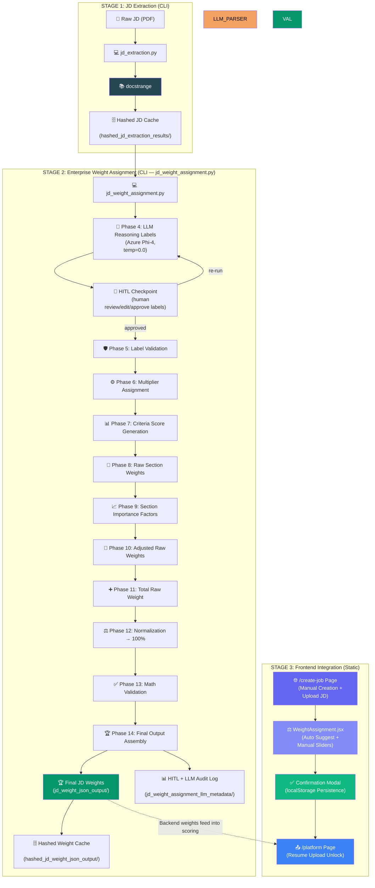
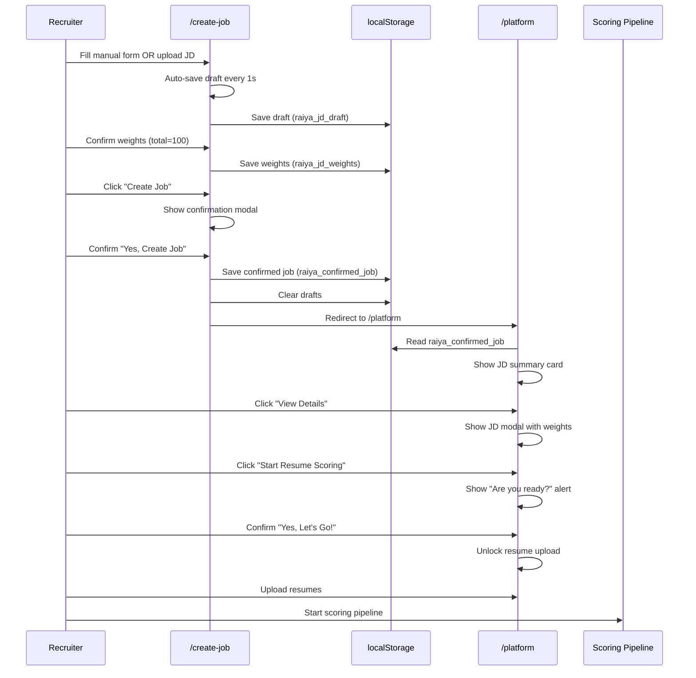

# JD Extraction & Weight Assignment — Final Workflow

## Module Overview

**Directory:** `jd_extraction_normalization_scoring_weight_assignment/`

This module is **Pipeline 2** of the RAIYA Recruiting Solution. It manages the lifecycle of Job Descriptions (JDs), translating raw PDF requirements into a **structured, weighted scoring schema** that the final scoring engine uses to evaluate candidates.

The process is divided into two distinct stages:
1.  **Stage 1: JD Extraction** — Converting raw PDFs into structured flat JSON via DocStrange standard extraction (no custom schema).
2.  **Stage 2: Weight Assignment** — 14-phase enterprise pipeline: LLM performs semantic reasoning (Phase 4 only), all mathematical operations are deterministic Python (Phases 5–13), with a HITL checkpoint between phases 4 and 5.

> [!IMPORTANT]
> This pipeline is also mirrored in the **RAIYA Frontend** via the `/create-job` page, which provides a fully static simulation of both manual JD creation and document upload/extraction workflows. The frontend persists confirmed jobs to `localStorage` for cross-page state management.

---

## 🏗️ Architecture Diagram



---

## 📂 Directory Structure

```
jd_extraction_normalization_scoring_weight_assignment/
├── jd_extraction.py                       # Stage 1 CLI: PDF → DocStrange standard flat JSON
├── jd_weight_assignment.py                # Stage 2 CLI: 14-phase enterprise pipeline + HITL
├── jd_weight_schema_validation.py         # Schema validation (legacy flat + enterprise rich format)
├── requirements.txt                       # Dependency list
│
├── sample_jd/                             # [INPUT] Raw JD PDFs
├── hashed_jd_extraction_results/          # [CACHE] SHA-256 JD extraction cache
│
├── jd_weight_json_output/                 # [FINAL] Production-ready Scoring JSONs
├── hashed_jd_weight_json_output/          # [CACHE] Hashed weight output cache
└── jd_weight_assignment_llm_metadata/     # [AUDIT] LLM reasoning + HITL audit logs
```

---

## 🚀 Step-by-Step Workflow

### Stage 1: Extraction (CLI)
1.  **Place PDF**: Move your Job Description PDF file into the `sample_jd/` directory.
2.  **Run Extraction**: Execute `python jd_extraction.py`.
3.  **Selection**: Use the interactive menu to select the JD(s) you wish to extract.
4.  **Result**: The structured data is stored in `hashed_jd_extraction_results/` with a meta.json sidecar.

### Stage 2: Weight Assignment — 14-Phase Enterprise Pipeline (CLI)

> **Architecture principle**: LLM = semantic reasoning only (Phase 4). Deterministic Python = all math (Phases 5–13).

1.  **Run CLI**: Execute `python jd_weight_assignment.py`.
2.  **Select JD**: Interactive menu loads extracted JSONs from `hashed_jd_extraction_results/`.
3.  **HITL Mode**: Choose `[h] HITL mode` (default) or `[s] Skip HITL (auto-approve)`.
4.  **Phase 4 — LLM Reasoning Labels**: Azure Phi-4 analyzes the JD and assigns one of 7 controlled ontology labels (`mandatory_core_skill` → `irrelevant`) per criterion with `confidence` and `evidence`. Up to 3 retries on failure.
5.  **HITL Checkpoint**: Review the LLM-assigned labels interactively:
    - `[a]` Approve all labels as-is
    - `[e]` Edit a single criterion's label
    - `[s]` Edit all criteria in a section
    - `[v]` View evidence for a criterion
    - `[r]` Re-run LLM with the same JD
6.  **Phase 5 — Label Validation**: Deterministic corrections — invalid labels, low confidence (<0.75), or missing evidence each trigger a one-step downgrade.
7.  **Phase 6 — Multiplier Assignment**: Each label maps to a fixed multiplier (1.0 → 0.0).
8.  **Phase 7 — Criteria Scores**: `CriteriaScore = 100 × multiplier`.
9.  **Phase 8 — Raw Section Weights**: `RawWeight = avg(CriteriaScores)` per section.
10. **Phase 9 — Section Importance Factors**: `Factor = 0.4×RoleCriticality + 0.25×DensityScore + 0.2×BusinessPriority + 0.15×RetrievalImportance`.
11. **Phase 10–12 — Normalization**: Adjusted weights divided by total raw weight, scaled to 100. Rounding correction on largest section ensures exact sum = 100.0.
12. **Phase 13 — Math Validation**: Asserts total ≈ 100 (±0.5), no negatives, no score collapse.
13. **Phase 14 — Save & Export**: Final enterprise JSON saved to `jd_weight_json_output/` and cached in `hashed_jd_weight_json_output/`. HITL audit log and LLM metadata written to `jd_weight_assignment_llm_metadata/`.

#### Criteria Value Format (Enterprise Output)

Each criterion in the `scoring` section now uses a rich object instead of a plain number:

```json
"Python": {
  "score": 100,
  "reasoning_label": "mandatory_core_skill",
  "multiplier": 1.0,
  "confidence": 0.97,
  "evidence": "Python is listed as a required technology"
}
```

### Stage 3: Frontend JD Creation & Weight Assignment (Next.js)

The RAIYA frontend provides a fully static simulation of both JD creation workflows, accessible at `/create-job`:

#### A. Manual JD Creation Flow
1.  **Navigate**: Go to `/create-job` → "Manual Creation" tab is active by default.
2.  **Auto-fill**: Form fields are pre-populated from the recruiter profile stored in `localStorage` (Job Role, Department, Work Mode, Location).
3.  **6-Step Form**: Complete the wizard:
    - **Step 1 — Basic Info**: Job Role, Department, Employment Type, Work Mode, Location, Salary Range, Positions, Deadline
    - **Step 2 — Experience**: Min/Max Experience, Qualification, Preferred Qualification, Domain Expertise
    - **Step 3 — Skills**: Required Skills, Preferred Skills, Soft Skills (all tag inputs)
    - **Step 4 — Technologies**: Technologies, Frameworks, Databases, Tools, Cloud
    - **Step 5 — Duties**: Dynamic responsibility list builder
    - **Step 6 — Screening**: Question builder (Yes/No, MCQ, Text types)
4.  **Weight Assignment**: Use the sticky right-side panel:
    - **Auto Suggest**: Click to simulate AI-generated weights (2s loading)
    - **Manual**: Adjust 10 section weights via range sliders
    - **Confirm**: Lock weights when total equals 100
5.  **Auto-save**: Draft is saved to `localStorage` every second (debounced).
6.  **Publish**: Click "Create Job & Go to Platform" → shadowy confirmation modal → "Yes, Create Job" → saved to `localStorage` as `raiya_confirmed_job` → redirects to `/platform`.

#### B. Upload JD Document Flow
1.  **Navigate**: Go to `/create-job` → switch to "Upload JD Document" tab.
2.  **Upload**: Drag-drop or click to select a PDF/DOCX file.
3.  **Extraction Simulation**: Three-stage loading (Uploading → Extracting with AI → Generating Weights).
4.  **Preview**: Extracted JD content is displayed with all parsed fields, skills, and responsibilities.
5.  **Weight Assignment**: Auto-generated weights are shown (editable with same panel).
6.  **Confirm & Publish**: Same shadowy modal flow → `localStorage` → `/platform` redirect.

#### C. Platform Integration (Resume Scoring Gate)
1.  **Platform Check**: `/platform` reads `raiya_confirmed_job` from `localStorage`.
2.  **Locked State**: If no confirmed job → Lock icon + "Create Job Description" CTA.
3.  **Unlocked State**: Shows JD summary card → "View Details" shadowy modal with full JD + weights → "Are you ready for resume scoring?" alert → Resume upload unlocked.

---

## 🔄 Frontend–Backend Data Flow



---

## 🛡️ Validation Rules (Mandatory)

The `jd_weight_schema_validation.py` script enforces the following criteria:

*   **100% Total Weight**: The sum of `Relevant Experience + Experience + Qualification + Technologies + Skills + Position + Tools + Salary` must be exactly 100.
*   **Canonical Keys**: Scoring criteria for fixed sections (like `experience`) must use pre-defined buckets (e.g., `3-4 years`, `5-7 years`).
*   **No Redundancy**: Prevents duplicate skill or technology entries within the scoring blocks.
*   **Presence of Hash**: Validates that the original extraction hash (`jd_content_hash`) is preserved for tracking.

> [!NOTE]
> The frontend weight assignment mirrors the same 100% validation rule. The "Confirm Weights" button is disabled until the total equals exactly 100. The total progress bar is color-coded: green (=100), amber (<100), red (>100).

---

## 📊 Data Mapping Table

| File Type | Location | Purpose |
|-----------|----------|---------|
| **Raw PDF** | `sample_jd/` | Input for the whole pipeline |
| **Extracted JSON** | `jd_extraction_outputs/` | Raw structured data without weights |
| **Hashed Extraction** | `hashed_jd_extraction_results/` | Cached binary fingerprint of JD content |
| **Production Weights** | `jd_weight_json_output/` | Final output consumed by Similarity Scoring |
| **LLM Metadata** | `jd_weight_assignment_llm_metadata/` | Audit logs (usage, system fingerprints) |

### Frontend localStorage Keys

| Key | Type | Purpose |
|-----|------|---------|
| `raiya_jd_draft` | JSON | Form data draft (auto-saved, cleared on publish) |
| `raiya_jd_weights` | JSON | Weight data draft (auto-saved, cleared on publish) |
| `raiya_weights_confirmed` | Boolean | Whether weights have been confirmed |
| `raiya_confirmed_job` | JSON | Final confirmed job with formData + weights + timestamp |
| `raiya_recruiter_profile` | JSON | Recruiter profile settings for auto-fill |

---

## 🧩 Frontend JD Components

| Component | File | Purpose |
|-----------|------|---------|
| **JobForm** | `components/jd/JobForm.jsx` | 6-step wizard with stepper navigation |
| **WeightAssignment** | `components/jd/WeightAssignment.jsx` | Accordion-based weight panel with progress bar |
| **WeightSlider** | `components/jd/WeightSlider.jsx` | Individual range slider with live value |
| **CriteriaAccordion** | `components/jd/CriteriaAccordion.jsx` | Expandable section with criteria sliders |
| **TagInput** | `components/jd/TagInput.jsx` | Animated tag input with add/remove |
| **ResponsibilityBuilder** | `components/jd/ResponsibilityBuilder.jsx` | Dynamic numbered list builder |
| **ScreeningQuestionBuilder** | `components/jd/ScreeningQuestionBuilder.jsx` | Question builder (Yes/No, MCQ, Text) |
| **UploadJD** | `components/jd/UploadJD.jsx` | Drag-drop upload with extraction simulation |
| **JDPreview** | `components/jd/JDPreview.jsx` | Real-time live JD preview card |


### Hashing Schema format json for jd pdf extraction as well as jd weight assignment(both for manual job creation and upload jd document):
```
{
  "sha256": "",
  "source_file": "",
  "source_type": "",
  "encoding": "",
  "stored_at": "",
  "content_length": ,
  "extracted_text_length": 
}
```