# JD Extraction & Weight Assignment — MySQL DB ERD Diagram

This document contains the Entity-Relationship Diagram (ERD) for the Job Description extraction and scoring weight assignment module. This design translates the hierarchical JSON scoring model and the underlying caching infrastructure into a normalized relational database schema.

## ER Diagram (Graphviz)

```dot
graph ERD {
    rankdir=TB;
    node [fontname="Segoe UI, Arial", fontsize=10, shape=box, style=filled, fillcolor="#f8f9fa", color="#adb5bd"];
    edge [fontname="Segoe UI, Arial", fontsize=9, color="#6c757d"];

    // --- INFRASTRUCTURE ENTITIES ---
    JD_FILE [label="JD_FILE\n(Raw PDF Metadata)", fillcolor="#e9ecef"];
    HASH_REG [label="HASH_REGISTRY\n(Content Fingerprint)", fillcolor="#fff3cd"];
    LLM_META [label="LLM_METADATA\n(Audit Logs)", fillcolor="#f8d7da"];

    // --- CORE DATA ENTITIES ---
    JD [label="JOB_DESCRIPTION", fillcolor="#cfe2ff"];
    JD_LIST [label="JD_LIST_ATTRIBUTE", fillcolor="#d1e7dd"];
    SCORING_SEC [label="SCORING_SECTION", fillcolor="#fff3cd"];
    CRITERIA [label="SCORING_CRITERIA", fillcolor="#fff3cd"];
    SALARY [label="SALARY_SCORING", fillcolor="#f8d7da"];
    SALARY_CRIT [label="SALARY_CRITERIA", fillcolor="#f8d7da"];

    // --- RELATIONSHIPS ---
    node [shape=diamond, style=filled, fillcolor="#ffffff", color="#adb5bd"];
    CACHED_AS [label="CACHED_AS"];
    PRODUCES [label="PRODUCES"];
    RECORDS [label="RECORDS"];
    HAS_LIST [label="HAS_LIST"];
    HAS_SECTION [label="HAS_SECTION"];
    HAS_CRITERIA [label="HAS_CRITERIA"];
    HAS_SALARY [label="HAS_SALARY"];
    HAS_S_CRIT [label="HAS_SALARY_CRIT"];

    // --- ATTRIBUTES - JD_FILE ---
    node [shape=ellipse, style=none, fillcolor=none, color="#6c757d"];
    FILE_ID [label=<<u>file_id</u>>];
    FILE_NAME [label="file_name"];
    FILE_HASH [label="sha256_hash"];
    FILE_SIZE [label="size_bytes"];
    
    JD_FILE -- FILE_ID;
    JD_FILE -- FILE_NAME;
    JD_FILE -- FILE_HASH;
    JD_FILE -- FILE_SIZE;

    // --- ATTRIBUTES - HASH_REGISTRY ---
    REG_ID [label=<<u>registry_id</u>>];
    CONT_HASH [label="content_hash (Unique)"];
    EXT_PATH [label="extraction_path"];
    W_PATH [label="weights_path"];

    HASH_REG -- REG_ID;
    HASH_REG -- CONT_HASH;
    HASH_REG -- EXT_PATH;
    HASH_REG -- W_PATH;

    // --- ATTRIBUTES - LLM_METADATA ---
    META_ID [label=<<u>meta_id</u>>];
    MODEL [label="model_name"];
    PROMPT_V [label="prompt_version"];
    USAGE [label="total_tokens"];
    FINGERPRINT [label="system_fingerprint"];

    LLM_META -- META_ID;
    LLM_META -- MODEL;
    LLM_META -- PROMPT_V;
    LLM_META -- USAGE;
    LLM_META -- FINGERPRINT;

    // --- ATTRIBUTES - JD ---
    JD_ID [label=<<u>jd_id</u>>];
    JD_TITLE [label="job_title"];
    JD_HASH [label="jd_content_hash (FK)"];
    JD_EXP [label="experience"];
    JD_QUAL [label="qualification"];
    JD_POS [label="position"];

    JD -- JD_ID;
    JD -- JD_TITLE;
    JD -- JD_HASH;
    JD -- JD_EXP;
    JD -- JD_QUAL;
    JD -- JD_POS;

    // --- ATTRIBUTES - JD_LIST ---
    LIST_ID [label=<<u>attr_id</u>>];
    TYPE [label="attribute_type\n(skill|tech|tool|cert)"];
    VALUE [label="attribute_value"];

    JD_LIST -- LIST_ID;
    JD_LIST -- TYPE;
    JD_LIST -- VALUE;

    // --- ATTRIBUTES - SCORING_SECTION ---
    SEC_ID [label=<<u>section_id</u>>];
    SEC_NAME [label="section_name"];
    SEC_WEIGHT [label="weight (0-100)"];

    SCORING_SEC -- SEC_ID;
    SCORING_SEC -- SEC_NAME;
    SCORING_SEC -- SEC_WEIGHT;

    // --- ATTRIBUTES - CRITERIA ---
    CRIT_ID [label=<<u>criteria_id</u>>];
    CRIT_LABEL [label="label"];
    CRIT_SCORE [label="score (0-100)"];

    CRITERIA -- CRIT_ID;
    CRITERIA -- CRIT_LABEL;
    CRITERIA -- CRIT_SCORE;

    // --- ATTRIBUTES - SALARY_SCORING ---
    SAL_ID [label=<<u>salary_id</u>>];
    SAL_WEIGHT [label="weight"];
    FALLBACK [label="fallback_score"];

    SALARY -- SAL_ID;
    SALARY -- SAL_WEIGHT;
    SALARY -- FALLBACK;

    // --- ATTRIBUTES - SALARY_CRITERIA ---
    SCRIT_LABEL [label="label (e.g. '3-6')"];
    SCRIT_SCORE [label="score"];

    SALARY_CRIT -- SCRIT_LABEL;
    SALARY_CRIT -- SCRIT_SCORE;

    // --- INFRASTRUCTURE CONNECTIONS ---
    JD_FILE -- CACHED_AS [label="1"];
    CACHED_AS -- HASH_REG [label="1"];
    
    HASH_REG -- PRODUCES [label="1"];
    PRODUCES -- JD [label="1"];
    
    HASH_REG -- RECORDS [label="1"];
    RECORDS -- LLM_META [label="1"];

    // --- CORE DATA CONNECTIONS ---
    JD -- HAS_LIST [label="1"];
    HAS_LIST -- JD_LIST [label="n"];

    JD -- HAS_SECTION [label="1"];
    HAS_SECTION -- SCORING_SEC [label="n"];

    SCORING_SEC -- HAS_CRITERIA [label="1"];
    HAS_CRITERIA -- CRITERIA [label="n"];

    JD -- HAS_SALARY [label="1"];
    HAS_SALARY -- SALARY [label="1"];

    SALARY -- HAS_S_CRIT [label="1"];
    HAS_S_CRIT -- SALARY_CRIT [label="n"];
}
```

## Database Design Rationale

### 1. Hashing & Deduplication (`HASH_REGISTRY`)
Every Job Description PDF is hashed binary-first. The `HASH_REGISTRY` acting as a central record ensures that if two identical files (even with different names) are processed, they point to the same extraction and weight configuration. This saves LLM costs and ensures scoring consistency.

### 2. Auditability (`LLM_METADATA`)
Linked 1:1 with the content hash, this entity stores the technical payload of the AI generation. It tracks the specific model used, the prompt version, and token consumption, which is critical for system debugging and cost analysis.

### 3. Normalization of Multivalued Attributes
Lists like `skills`, `technologies`, and `tools` are normalized into the `JD_LIST_ATTRIBUTE` table. This avoids storing multiple values in a single column, satisfying 1st Normal Form (1NF).

### 4. Hierarchical Scoring Logic
The scoring model translates the nested JSON structure into a relational hierarchy:
*   **SCORING_SECTION**: Stores the weight of a top-level category (e.g., "Skills").
*   **SCORING_CRITERIA**: Stores the individual score buckets within that section.
*   **REASONING**: This allows the scoring engine to calculate results via simple SQL Joins rather than complex JSON parsing.

### 5. Integrity Constraints
*   **Primary Keys**: All entities have unique IDs for indexing.
*   **Foreign Keys**: Explicit links (`jd_hash`, `section_id`, etc.) ensure referential integrity.
*   **Unique Index**: `content_hash` prevents redundant data entry for the same JD.
