# Resume Extraction & Normalization — MySQL DB ERD Diagram

This document contains the Entity-Relationship Diagram (ERD) for the modularized resume extraction and normalization pipeline. The design follows the principles of normalization (1NF, 2NF, 3NF) and includes the infrastructure layer for content-hash caching and validation auditing.

## ER Diagram (Graphviz)

```dot
graph ERD {
    // Resume Extraction Infrastructure & Data ERD
    rankdir=TB;
    node [fontname="Segoe UI, Arial", fontsize=10, shape=box, style=filled, fillcolor="#f8f9fa", color="#adb5bd"];
    edge [fontname="Segoe UI, Arial", fontsize=9, color="#6c757d"];

    // --- INFRASTRUCTURE ENTITIES ---
    RES_FILE [label="RESUME_FILE\n(Raw Metadata)", fillcolor="#e9ecef"];
    HASH_REG [label="HASH_REGISTRY\n(Content Fingerprint)", fillcolor="#fff3cd"];
    VALID_AUDIT [label="VALIDATION_AUDIT\n(Pydantic Results)", fillcolor="#f8d7da"];

    // --- CORE DATA ENTITIES ---
    CANDIDATE [label="CANDIDATE", fillcolor="#cfe2ff"];
    EXPERIENCE [label="EXPERIENCE", fillcolor="#d1e7dd"];
    EDUCATION [label="EDUCATION", fillcolor="#d1e7dd"];
    PROJECT [label="PROJECT", fillcolor="#d1e7dd"];

    // --- WEAK / LIST ENTITIES ---
    RESP [label="RESPONSIBILITY", fillcolor="#e9ecef"];
    PROJ_TECH [label="PROJECT_TECHNOLOGY", fillcolor="#e9ecef"];
    SKILL [label="SKILL", fillcolor="#f8f9fa"];
    TOOL [label="TOOL", fillcolor="#f8f9fa"];
    TECH [label="TECHNOLOGY", fillcolor="#f8f9fa"];
    CERT [label="CERTIFICATION", fillcolor="#f8f9fa"];
    ACHIEVE [label="ACHIEVEMENT", fillcolor="#f8f9fa"];

    // --- RELATIONSHIPS ---
    node [shape=diamond, style=filled, fillcolor="#ffffff", color="#adb5bd"];
    CACHED_AS [label="CACHED_AS"];
    PRODUCES [label="PRODUCES"];
    AUDITED_BY [label="AUDITED_BY"];
    HAS_EXP [label="HAS_EXPERIENCE"];
    HAS_EDU [label="HAS_EDUCATION"];
    HAS_PROJ [label="HAS_PROJECT"];
    HAS_RESP [label="HAS_RESPONSIBILITY"];
    HAS_PTECH [label="HAS_TECH"];
    HAS_LIST [label="HAS_LIST"];

    // --- ATTRIBUTES - RESUME_FILE ---
    node [shape=ellipse, style=none, fillcolor=none, color="#6c757d"];
    FILE_ID [label=<<u>file_id</u>>];
    FILE_NAME [label="file_name"];
    FILE_HASH [label="sha256_hash"];
    
    RES_FILE -- FILE_ID;
    RES_FILE -- FILE_NAME;
    RES_FILE -- FILE_HASH;

    // --- ATTRIBUTES - HASH_REGISTRY ---
    REG_ID [label=<<u>registry_id</u>>];
    CONT_HASH [label="content_hash (Unique)"];
    VALID_PATH [label="validated_json_path"];

    HASH_REG -- REG_ID;
    HASH_REG -- CONT_HASH;
    HASH_REG -- VALID_PATH;

    // --- ATTRIBUTES - VALIDATION_AUDIT ---
    AUDIT_ID [label=<<u>audit_id</u>>];
    IS_VALID [label="is_valid"];
    FIELDS [label="populated_count"];
    ERRORS [label="error_list"];

    VALID_AUDIT -- AUDIT_ID;
    VALID_AUDIT -- IS_VALID;
    VALID_AUDIT -- FIELDS;
    VALID_AUDIT -- ERRORS;

    // --- ATTRIBUTES - CANDIDATE ---
    CAND_ID [label=<<u>candidate_id</u>>];
    FULL_NAME [label="full_name"];
    EMAIL [label="email (Unique)"];
    SAL_VAL [label="salary_value"];
    SAL_CUR [label="salary_currency"];

    CANDIDATE -- CAND_ID;
    CANDIDATE -- FULL_NAME;
    CANDIDATE -- EMAIL;
    CANDIDATE -- SAL_VAL;
    CANDIDATE -- SAL_CUR;

    // --- ATTRIBUTES - EXPERIENCE ---
    EXP_ID [label=<<u>exp_id</u>>];
    JOB_TITLE [label="job_title"];
    COMPANY [label="company_name"];
    START [label="start_date"];
    END [label="end_date"];

    EXPERIENCE -- EXP_ID;
    EXPERIENCE -- JOB_TITLE;
    EXPERIENCE -- COMPANY;
    EXPERIENCE -- START;
    EXPERIENCE -- END;

    // --- ATTRIBUTES - LIST VALUES ---
    LIST_VAL [label="value"];
    
    SKILL -- LIST_VAL;
    TOOL -- LIST_VAL;
    TECH -- LIST_VAL;
    CERT -- LIST_VAL;
    ACHIEVE -- LIST_VAL;

    // --- INFRASTRUCTURE CONNECTIONS ---
    RES_FILE -- CACHED_AS [label="1"];
    CACHED_AS -- HASH_REG [label="1"];
    
    HASH_REG -- PRODUCES [label="1"];
    PRODUCES -- CANDIDATE [label="1"];
    
    CANDIDATE -- AUDITED_BY [label="1"];
    AUDITED_BY -- VALID_AUDIT [label="1"];

    // --- CORE DATA CONNECTIONS ---
    CANDIDATE -- HAS_EXP [label="1"];
    HAS_EXP -- EXPERIENCE [label="n"];

    EXPERIENCE -- HAS_RESP [label="1"];
    HAS_RESP -- RESP [label="n"];

    CANDIDATE -- HAS_EDU [label="1"];
    HAS_EDU -- EDUCATION [label="n"];

    CANDIDATE -- HAS_PROJ [label="1"];
    HAS_PROJ -- PROJECT [label="n"];

    PROJECT -- HAS_PTECH [label="1"];
    HAS_PTECH -- PROJ_TECH [label="n"];

    // Multi-valued Lists
    CANDIDATE -- HAS_LIST [label="1"];
    HAS_LIST -- SKILL [label="n"];
    HAS_LIST -- TOOL [label="n"];
    HAS_LIST -- TECH [label="n"];
    HAS_LIST -- CERT [label="n"];
    HAS_LIST -- ACHIEVE [label="n"];
}
```



## Database Design Rationale

### 1. Unified Hashing & Caching
The pipeline begins at the `RESUME_FILE` level. By hashing the binary content and registering it in `HASH_REGISTRY`, we ensure that identical resumes across different filenames are only processed once. This links the source file directly to the normalized `CANDIDATE` record.

### 2. Auditability with Pydantic
The `VALIDATION_AUDIT` table stores the output of the Pydantic validation layer. It tracks which fields were successfully extracted, which requires coercion, and any structural errors. This provides a clear "data health" metric for every candidate record.

### 3. Deep Normalization (3NF)
All nested data in the original resume JSON has been flattened into relational tables:
*   **EXPERIENCE → RESPONSIBILITY**: A 1:M relationship that preserves the context of specific role duties.
*   **PROJECT → PROJECT_TECHNOLOGY**: Handles the "technologies used" list within specific projects.
*   **Multivalued Attributes**: Simple lists like `skills` and `certifications` are given dedicated tables to allow for robust filtering and search in the final UI.

### 4. Integrity Constraints
*   **Foreign Keys**: Explicit links (`candidate_id`, `exp_id`, `project_id`) ensure that orphan records are not created.
*   **Unique Constraints**: `email` and `content_hash` act as natural keys to prevent duplicate candidate entries.
*   **Metadata Link**: The `CANDIDATE` entity is linked to the `HASH_REGISTRY` to trace every record back to its source extraction path.


### Hashing Schema format json:
```
{
  "sha256": "",
  "source_file": "",
  "source_type": "",
  "encoding": "",
  "stored_at": "",
  "content_length": ,
  "extracted_text_length": 
}
```