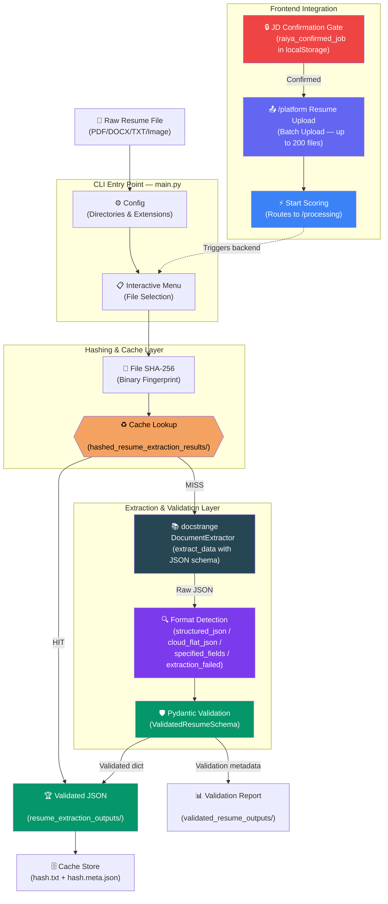
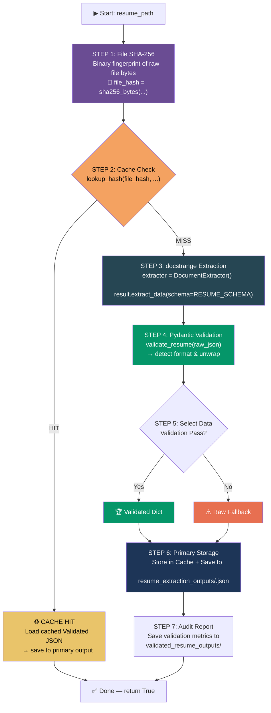
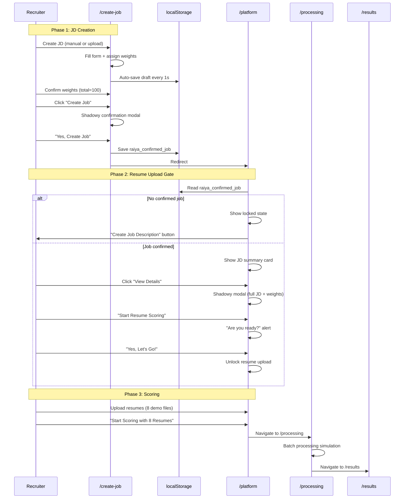
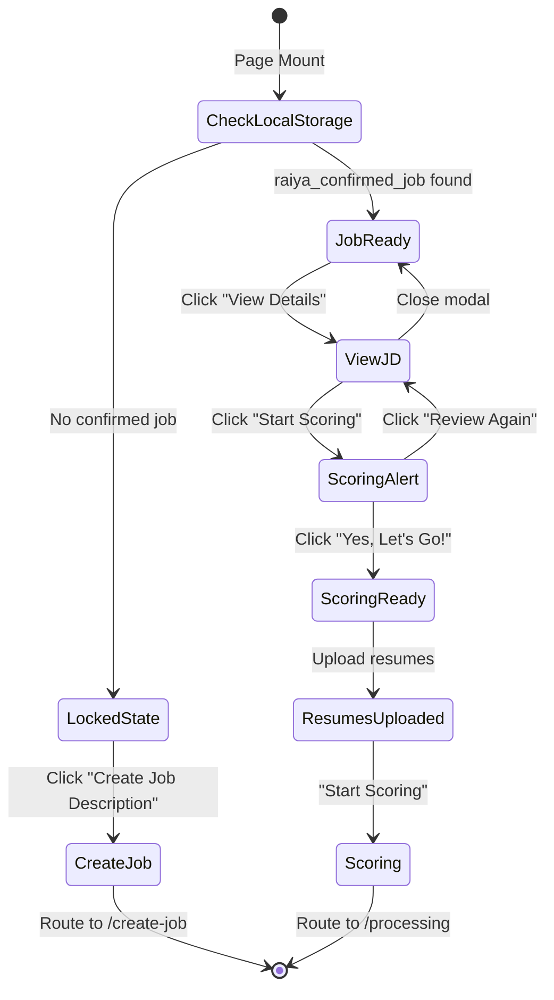
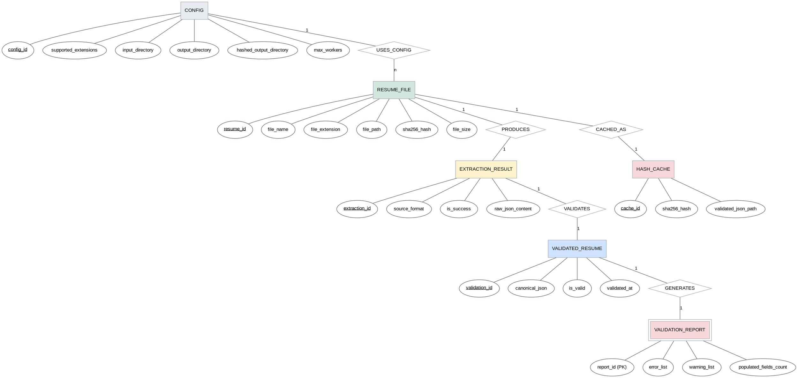

# Resume Extraction & Parsing — Final Workflow

## Module Overview

**Directory:** `modularized_resume_extraction_normalization/`

This module is **Pipeline 1** of the RAIYA Recruiting Solution — the foundational data preparation layer. It takes raw resume files (PDF, DOCX, TXT, images) and converts them into clean, structured JSON with consistent field normalization. The module leverages the **DocStrange document extraction engine** for all processing, followed by a **Pydantic-based schema validation layer** that normalizes outputs into a single canonical schema.

> [!IMPORTANT]
> **Design Principles:**
> - **Unified Extraction** — Rely on the DocStrange document extraction library for all format handling (PDF, DOCX, Images).
> - **Schema-First Storage** — Only validated and normalized JSON is stored in the primary output and cache directories.
> - **Content-aware caching** — SHA-256 of raw file bytes enables deduplication across renamed/resubmitted files.
> - **Auditability** — Detailed validation reports are stored separately for every extraction run.

> [!NOTE]
> **Frontend Integration:** The RAIYA frontend (`/platform` page) simulates this pipeline's resume upload step. Resumes are only uploadable after the recruiter has created and confirmed a Job Description with weights via the `/create-job` page. The frontend uses `localStorage` to gate access: `raiya_confirmed_job` must exist before the resume upload section is unlocked.

---

## Architecture



---

## Module Structure

```
modularized_resume_extraction_normalization/
├── main.py                                    # CLI entry point & processing pipeline
├── streamlit_resume_extraction.py             # Streamlit GUI with validation integration
├── requirements.txt                           # Dependency list (Python 3.12.0)
├── resume_extraction_parsing_final_workflow.md # ← This document
│
├── modules/
│   ├── __init__.py                # Package init — re-exports all public APIs
│   ├── config.py                  # Config class — directories, supported extensions, knobs
│   ├── file_utils.py              # File discovery, size formatting, filename sanitization
│   ├── menu.py                    # Interactive CLI menu — selection parsing
│   ├── hashing.py                 # SHA-256 hashing + cache system
│   ├── resume_schema_validation.py    # Pydantic schema validation & normalization
│   ├── reference_parsed_resume_format.json  # Canonical resume schema reference
│   └── docstrange-main/           # Embedded document extraction library
│
├── resume_extraction_outputs/         # Primary output (Validated & Normalized JSON)
│   └── *.json
│
├── validated_resume_outputs/          # Audit directory (Validation reports)
│   └── *_validation_report.json
│
├── hashed_resume_extraction_results/  # Content hash cache (Stores Validated JSON)
│   ├── <sha256>.txt
│   └── <sha256>.meta.json
│
└── resumes/                           # Input resume files
```

---

## Per-Resume Processing Pipeline — Simple 7-Step Flow

The `process_single_resume()` function executes the following pipeline for each file:



---

## Frontend Resume Upload Workflow

The RAIYA frontend simulates the resume upload and scoring trigger process. This workflow is gated by Job Description creation and confirmation.

### End-to-End Frontend Flow



### Platform Page State Machine



### Frontend Gate Logic

| Condition | Platform State | Resume Upload |
|-----------|---------------|---------------|
| No `raiya_confirmed_job` | Lock icon + "Create Job Description" CTA | **Locked** (hidden) |
| Job confirmed, not reviewed | JD summary card + "View Details" button | **Locked** (overlay) |
| Job reviewed + scoring confirmed | Full JD visible, resume section active | **Unlocked** |
| Resumes uploaded | File list with remove buttons | "Start Scoring" button active |

---

## Output Locations

| Output | Path | Format |
|--------|------|--------|
| **Validated JSON** | `resume_extraction_outputs/<stem>.json` | Primary clean output |
| **Validation report** | `validated_resume_outputs/<stem>_validation_report.json` | Audit diagnostics |
| **Hash cache** | `hashed_resume_extraction_results/` | Validated data store |

---

## Running the Pipeline

### Prerequisites

```bash
# Install dependencies from requirements.txt
pip install -r requirements.txt
```

### Execution — CLI

```bash
python main.py
```

### Execution — Streamlit GUI

```bash
streamlit run streamlit_resume_extraction.py
```

### Execution — Frontend (Static Demo)

```bash
cd raiya-resume-scoring-frontend
npm install
npm run dev
# Navigate to http://localhost:3000/create-job → create JD → /platform → upload resumes
```

---

## Pipeline Infrastructure ERD (Conceptual)

The following diagram illustrates the conceptual relationships between high-level system components such as the configuration, raw files, extraction results, and the cache layer. This is distinct from the database ERD and focuses on the file-and-process infrastructure.


