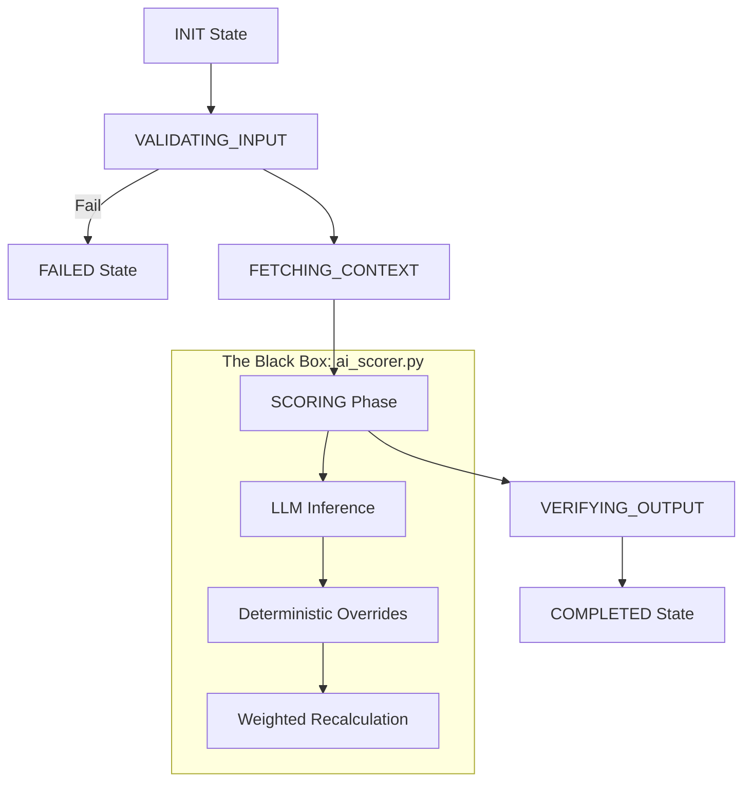

# Scoring Agent: System Architecture & Logic Guide

The Scoring Agent is a high-assurance, state-driven system designed to evaluate candidate resumes against Job Descriptions (JD). Unlike a simple "LLM Wrapper," this agent utilizes a **Hybrid Scoring Model** that combines semantic reasoning (LLM) with deterministic logic (Python) and rigorous governance.

---

## 1. Core Operating Principles
The agent operates under three primary design philosophies:
1. **Closed-World Assumption**: The agent can only transition between predefined states; any unauthorized jump triggers a security violation.
2. **Deterministic Sovereignty**: In cases of conflict between AI "hallucinations" and objective facts (like dates or currency), **Python logic always wins**.
3. **Evidence-Based Scoring**: The AI is forbidden from inferring skills; if a skill is not explicitly evidenced in the experience description, it receives zero points.

---

## 2. High-Level Flow (State Machine)

---

## 3. Modular Breakdown

### A. The Orchestrator (`AgentController` & `AgentMemory`)
*   **Module**: `agent_controller.py`
*   **Role**: The "Brain" that manages the control flow.
*   **Process**: It iterates through a loop, calling `step()` until it reaches a terminal state (`COMPLETED` or `FAILED`). It keeps all data (inputs, weights, intermediate results) in a central `AgentMemory` object.

### B. The Gatekeeper (`AgentGuardrails`)
*   **Module**: `app/ai_guardrails.py`
*   **Role**: Safety and Data Integrity.
*   **Process**: 
    1. **Pre-Flight**: Checks if the ID and Resume have minimum required fields (Fail-fast).
    2. **Post-Flight**: Ensures the AI output is not empty and conforms to the expected 0-100 range.

### C. The Judge (`ai_scorer.py`)
This is where the majority of the logic resides. It follows a multi-phase internal pipeline:

1.  **Normalization**: Converts raw JD criteria and Resume data into stable formats (e.g., converting Indian Rupees to the "Lakhs Per Annum - LPA" format).
2.  **Evidence Enforcement (Critical Step)**: It **strips** the `skills` and `technologies` lists from the resume JSON before sending it to the LLM. This forces the LLM to search for evidence *inside* the job descriptions rather than just seeing a list of keywords.
3.  **LLM Inference**: Calls Azure OpenAI to get raw component scores (Skills, Tools, etc.) and a "Scoring Trace" (explanation).
4.  **Deterministic Overrides**:
    *   **Experience Snapping**: Calculates exact years from dates; if the AI says "8 years" but the dates prove "2.5 years," the score is forcibly dropped.
    *   **Salary Bounds**: Matches the candidate's LPA against the JD ranges using strict math.
    *   **Qualification Tiers**: Corrects misclassifications (e.g., a "BCA" being scored as a "B.Tech").
5.  **Weighted Summation**: Programmatically sums all component scores based on JD weights. The AI's self-calculated total is discarded.

### D. The Governance Layer (`AuthorityGovernance`)
*   **Module**: `agent_authority.py`
*   **Role**: Compliance and Monotonicity.
*   **Process**: Every state transition must be "Approved." It also validates that the final score data structure is strictly correct before allowing the agent to mark itself as `COMPLETED`.

---

## 4. Execution Logic & Methodology

### Step 1: Input Acquisition
The agent receives a `parsed_resume` (JSON) and a `jd` (JSON). If weights aren't provided, it automatically extracts them from the JD configuration.

### Step 2: Data Conditioning
*   **JD Validator**: Scales JD criteria to a 0-100 base.
*   **Salary Normalizer**: Normalizes currency formats to prevent LLM confusion with large numbers.

### Step 3: Secure Scoring
The agent enters the `SCORING` state. It invokes the `ai_scorer`, which performs the live LLM call. During this phase, it also logs token usage and latency for the `Monitor_Agent`.

### Step 4: Verification & Trace Reconciliation
Once the LLM returns, the scores are modified by overrides. The Agent then "syncs" the `scoring_trace`. 
> [!IMPORTANT]
> If a Python override changed a score from 100 to 40, the system updates the AI's explanation trace so the user doesn't see conflicting information.

### Step 5: Persistence & Reporting
The final JSON is saved to the `results/` directory. If the `pdf_report.py` module is triggered, it generates a branded, professional PDF summary of the entire assessment.

---

## 5. Security & Reliability Features
*   **Closed Whitelists**: Only specific transitions (e.g., `SCORING` -> `VERIFYING`) are allowed.
*   **Idempotency**: Retrying a step in the same state will not duplicate actions.
*   **Fail-Fast**: Any validation error immediately moves the agent to the `FAILED` state to avoid corrupted results.
